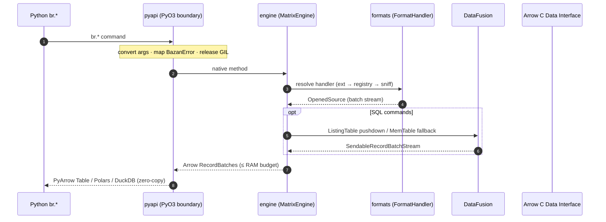
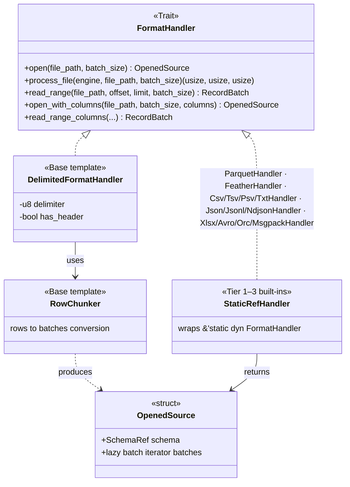

# ARCHITECTURE.md

System design summary for `basaltic-red` — a Rust compute core compiled as a Python extension (PyO3 + Maturin, `cdylib`). Full component pages live in [`en/architecture/`](en/architecture/); this file is the condensed map.

## Layers

## Design Decisions

| Decision | Where | Rationale |
| :--- | :--- | :--- |
| Single shared engine instance (`OnceLock`) | `src/pyapi/mod.rs` | Identical thresholds across all `br.*` namespaces |
| One error enum `BazanError`, one mapper | `src/error.rs`, `bazan_to_pyerr()` | Consistent messages; `ValueError`/`RuntimeError`/`IOError` split at the boundary only |
| Handler resolution: ext → registry → sniff | `formats/mod.rs::resolve_handler_for_file` | O(1) fast path; extension-less files still open |
| Static vs dynamic filtering split | `engine/filter.rs` vs `engine/dynamic_filter.rs` | Fixed-threshold hot path needs no rule parsing; user rules go through the bitmask kernel |
| Multi-chunk `u64` bitmask, in-place | `dynamic_filter.rs` | No intermediate boolean arrays; >64 rules scale linearly; audit codes fall out for free |
| Lake catalog as Arrow IPC file | `engine/map.rs` | `<1 ms` memmap load replaces filesystem walks; doctor heals drift incrementally |
| Adaptive batch budget | `engine/memory.rs` | N streams × `budget_batch_rows(N)` keeps total RAM ≤ `BASALTIC_RED_MAX_RAM_GB` (default 2 GB) |
| SQL dual-path target resolution | `engine/sql.rs` | Native ListingTable pushdown when possible; `.br_cache` Parquet transcode (mtime-validated) otherwise |

## Format Abstraction

Resolution order: **dynamic registry** (`register_format`) → static table → magic-byte sniff of the first 512 bytes.

## Key Invariants

1. Clean output always preserves the input schema exactly; only Trash gains audit columns.
2. Filtering never mutates data — it decides membership only.
3. Unknown columns / unsupported dtypes make a dynamic rule a no-op (never an error mid-stream).
4. Every file access resolves through a `FormatHandler`; there is no format-specific branch outside `formats/`.
5. Python-facing results are always PyArrow objects crossing via the zero-copy interface.

See also: [CODEBASE_REFERENCE.md](CODEBASE_REFERENCE.md) for the file-level map.
