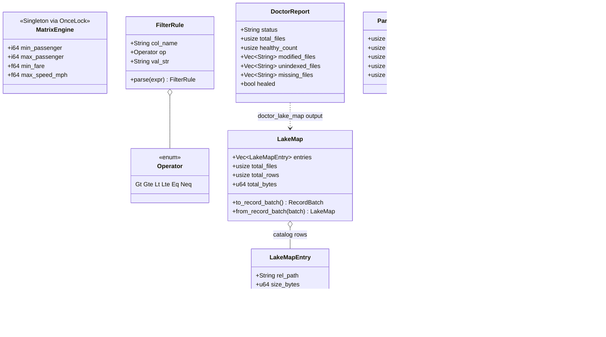

# CODEBASE_REFERENCE.md

File-by-file map of `src/`. Symbols listed are `pub` items verified against the current tree. For one-line meanings see [`en/glossary.md`](en/glossary.md).

## Key Data Structures

## Root

| File | Contents |
| :--- | :--- |
| `lib.rs` | `#[pymodule] basaltic_red`: exports `MatrixEngine`, `PyBatchIterator`, submodules `dictionary`, `filter`, `formats`, `graph`, `lake`, `read`, `sql` |
| `error.rs` | `BazanError`, `#[from]` wraps: Io, Arrow, Parquet, Json, Avro, Excel, Regex, DataFusion, GlobPattern, GlobWalk, ThreadPool; plus `UnsupportedFormat(String)`, `Message(String)` |
| `filter.rs` | Static audit flags: `ERR_INVALID_PASSENGER` (bit 0), `ERR_INVALID_FARE` (1), `ERR_INVALID_SPEED` (2) |
| `utils.rs` | `discover_data_files()`, `discover_parquet_files()`, recursive sorted walkers with partition filtering |

## engine/

| File | Contents |
| :--- | :--- |
| `mod.rs` | `MatrixEngine` struct (`min_passenger`, `max_passenger`, `min_fare`, `max_speed_mph`) + `new()` |
| `dynamic_filter.rs` | `Operator` (Gt/Gte/Lt/Lte/Eq/Neq), `FilterRule::parse()`, `MatrixEngine::filter_batch_dynamic()`, multi-chunk bitmask, appends `audit_error_code` (UInt64) and `audit_violated_rules` (List<UInt32>, rules > 64) |
| `filter.rs` | `filter_batch_native()`, Arrow-compute static filter, weighted code `p*1 + f*2 + s*4` |
| `slice.rs` | `slice_rows_native()`, `slice_cols_native()`, `DEFAULT_MAX_BATCH_SIZE` (1 << 20) |
| `parallel_filter.rs` | `ParallelFilterSummary` {total_files, pruned_dirs, total_rows, clean_rows, trash_rows}, `collect_target_files()` (file/dir/glob), `filter_files_parallel_native()` |
| `partition.rs` | `parse_path_partitions()`, `matches_partition_rules()`, `discover_and_prune_files()`, Hive-style pruning |
| `splitter.rs` | `split_file_native()` → `<stem>_part_NNN.<fmt>` parts |
| `ingest.rs` | `ingest_native()`, row formats (`csv…xlsx`) normalized to Parquet when `auto_normalize`/`BR_INGEST_NORMALIZE=1`; byte-copy otherwise; Rayon parallel |
| `map.rs` | `ColumnMinMax`, `FileStats`, `LakeMapEntry`, `LakeMap` (5-column schema), `DoctorReport` {status, healthy_count, modified/unindexed/missing, healed}; `build_lake_map()`, `save/load_lake_map_ipc()`, `resolve_map_path()`, `doctor_lake_map()`; `create_lake_map_native()`, `doctor_lake_map_native()` |
| `memory.rs` | `BUDGET_BATCH_ROWS` (1 << 20), `max_ram_bytes()` (`BASALTIC_RED_MAX_RAM_GB`, default 2 GB), `schema_row_bytes()`, `budget_batch_rows[_for]()`, `global_runtime()` (tokio), `global_rayon_pool()` |
| `csv_guard.rs` | `sanitize_cell()` / `sanitize_csv_batch()`, prefixes `'` to `=` `+` `@` and non-numeric `-` on CSV write |
| `graph.rs` | `generate_er_graph()`, Mermaid ER from a file or directory of tables |
| `recommend.rs` | `recommend_batch_size(parallel_streams)` |
| `sql.rs` | `listing_format_for()` (parquet/csv/tsv/psv/json*/arrow), top-level-JSON-array detection, `cached_parquet_for()` + `.br_cache` (`BASALTIC_RED_AUTO_NORMALIZE=1`, `BASALTIC_RED_CACHE_DIR`, mtime invalidation), ListingTable registration as `br_target`, `execute_sql*` |

## engine/formats/

| File | Contents |
| :--- | :--- |
| `mod.rs` | `OpenedSource` {schema, batches}, trait `FormatHandler` (open / process_file / read_range / *_columns), static `HANDLERS` table (15 ext), `StaticRefHandler`, dynamic registry (`register_format`/`unregister_format`/`list_supported_formats`), `handler_for()`, `sniff_format_from_bytes/file()` (PAR1, ARROW1, PK\x03\x04, Obj\x01, ORC, msgpack maps, `[`→json, `{`→ndjson, delimiter sniff), `resolve_handler_for_file()`, `maybe_hint_not_parquet()`, `clamp_batch_size()` |
| `core/parquet.rs` | `open_parquet[_columns]()`, `ParquetHandler`, `process_and_write_lake_native()` (mirrored trees, ZSTD), `generate_gold_table_native()` (+ `_gold_metadata.json`) |
| `core/arrow_ipc.rs` | `FeatherHandler` (memmap2 zero-copy reads) |
| `common/csv.rs` | `open_delimited_csv[_columns]()` (schema inference over 100 rows + `rewind()`), handlers: CsvHandler, TsvHandler, PsvHandler, TxtHandler |
| `common/json.rs` | JsonHandler, JsonlHandler, NdjsonHandler, `open_json_array()` (stream `[...]` as objects) |
| `plugins/adapters/excel.rs` | `XlsxHandler` + `XlsxRows` iterator (calamine) |
| `plugins/adapters/avro.rs` | `AvroHandler` |
| `plugins/adapters/orc.rs` | `OrcHandler` (orc-rust) |
| `plugins/adapters/msgpack.rs` | `MsgpackHandler` |
| `plugins/base_templates/delimited.rs` | `DelimitedFormatHandler::new(delimiter, has_header)`, template for custom delimited formats |
| `plugins/base_templates/row_chunker.rs` | `RowChunker<I, T, F>`, rows → batch conversion template |

## pyapi/

| File | Contents |
| :--- | :--- |
| `mod.rs` | `bazan_to_pyerr()` mapping; `default_engine()` singleton = `MatrixEngine::new(1, 9, 0.01, 100.0)` |
| `engine.rs` | All `#[pymethods]`: constructor (threshold args), process_file/batch, filter_matrix, filter_files_parallel, ingest, create_map, doctor, split_file, slice_rows/cols, preview_sample, process_and_write_lake, generate_gold_table, execute_sql[_stream], generate_er_graph_py, export_data_dictionary_md |
| `read.rs` / `filter.rs` / `lake.rs` / `sql.rs` / `dictionary.rs` / `graph.rs` / `formats.rs` | Thin `#[pyfunction]` wrappers delegating to `default_engine()`; each defines a `#[pymodule]` matching its namespace |
| `iterator.rs` | `PyBatchSource` (Eager Vec \| Lazy SendableRecordBatchStream), `PyBatchIterator` (`__iter__`/`__next__`, `to_pyarrow()`, repr), lazy pulls block on tokio inside `py.detach` |

Workspace members outside `src/`: `tools/bigdata-gen`, `tools/relational-db-gen` (data generators, not part of the SDK).
