# DEV_GUIDE.md

Developer workflow for `basaltic-red`. Requires Python ≥ 3.12 and a stable Rust toolchain; [`uv`](https://docs.astral.sh/uv/) drives everything.

## Change Lifecycle

```mermaid
stateDiagram-v2
    direction LR
    [*] --> Edited: modify src/
    Edited --> Built: uv run maturin develop --release
    Built --> Tested: cargo test + pytest
    Tested --> Linted: cargo clippy -D warnings
    Linted --> Documented: zensical build (EN + VI, no warnings)
    Documented --> Logged: changelog per rules
    Logged --> [*]: release checklist
```



## Setup

```bash
git clone https://github.com/VanDung-dev/basaltic-red.git
cd basaltic-red
uv sync --extra dev --extra interop
uv run maturin develop --release   # compile the Rust extension into .venv
```

Rebuild with `maturin develop --release` after every `src/` change before running Python tests.

## Test

| Suite | Command | Notes |
| :--- | :--- | :--- |
| Rust integration | `cargo test --all-targets` | Fixtures under `tests/*.rs` (formats, lake map, read_unified, parallel_filter…) |
| Python API | `uv run pytest tests/python/ -v` | `test_engine.py` is the executable API contract — keep docs examples in sync with it |
| Lint | `cargo clippy -- -D warnings` && `cargo check` | Must pass clean |

## Benchmark

```bash
cargo bench            # criterion suite: engine_benchmarks (filter + IO, wide tables)
```

Numbers quoted in docs belong in `en/other/benchmarks.md`; regenerate before updating claims.

## Docs

```bash
uv run zensical build                  # EN → site/
uv run zensical build -f mkdocs.vi.yml # VI → site/vi/
```

- Both builds must finish with **No issues found**.
- `en/` first, then mirror to `vi/` in the same commit (identical nav, counts, dates).
- VI heading anchors: diacritics stripped, `đ` dropped — check rendered HTML IDs when deep-linking.

## Changelog

Follow [`.agents/rules/01-changelog-rules.md`](../.agents/rules/01-changelog-rules.md):

1. Regenerate `commit.txt`: `git log --reverse --pretty='%h|%ad|%s' --date=short > commit.txt`
2. Keep only changes still reflected in `src/` (+ `Cargo.toml`); classify Improvements vs Fix.
3. Two admonitions under `## Unreleased` — `??? note "Improvements (N)"`, `??? warning "Fix (M)"` — dates nested newest-first, bullets labeled by component (`**Engine**:`, `**PyAPI**:`, …).
4. Mirror EN → VI; title counts must equal actual bullet counts.

## Release Checklist

1. `cargo test --all-targets` + `uv run pytest tests/python/ -v` green
2. `cargo clippy -- -D warnings` clean
3. Bump `[package].version` in `Cargo.toml` (single source of version truth)
4. Roll up `## Unreleased` into a dated version heading in both changelogs
5. Both doc sites build warning-free
