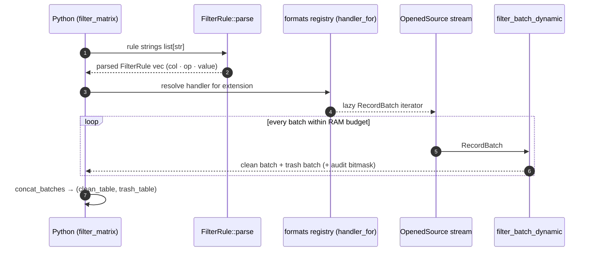

# Filtering Pipeline

Two entry points share the same [bitmask kernel](simd-kernel.md):

- `filter_matrix(file_path, rules)`, one file, returns `(clean_table, trash_table)`.
- `filter_files_parallel(path_pattern, rules)`, many files via Rayon, returns a summary dict.

---

## Single-File Flow (`engine` + `pyapi/engine.rs::filter_matrix`)



Filtering runs batch-by-batch so peak memory stays at [batch budget](#memory-behavior), not file size.

## Multi-File Parallel Filter (`engine/parallel_filter.rs`)

1. **Target collection**, `collect_target_files()` accepts a single file path, a directory (walked recursively), or a glob pattern (`*`, `?`, `[...]`). Directories are walked with partition awareness.
2. **Partition pruning**, for Hive-style layouts (`year=2026/month=08/...`), `parse_path_partitions()` extracts key/value pairs from each path and `matches_partition_rules()` drops whole files before opening them. Pass an explicit filter like `"year=2026/month=08"` or rules on partition columns.
3. **Rayon execution**, surviving files are filtered across the global Rayon pool; optional `num_threads` overrides pool width.
4. **Summary**, counts are reduced into a dict:

```python
summary = br.filter.filter_files_parallel(
    "data/yellow_tripdata_2025-*.parquet",
    rules=["passenger_count > 0", "fare_amount >= 2.5"],
)
# {
#   "total_files": 12,
#   "pruned_dirs": 0,      # directories skipped entirely by partition pruning
#   "total_rows": 51_660_072,
#   "clean_rows":  50_112_004,
#   "trash_rows":  1_548_068,
# }
```

!!! note "Parallel mode writes no output"

    `filter_files_parallel` is a *counting* pass, it reports how many rows would survive. To materialize clean/trash Parquet outputs per directory, use [`br.lake.process_and_write_lake`](lakehouse-pipeline.md).

---

## Memory Behavior

Batch sizes adapt to the RAM budget: each of N concurrent streams gets `budget_batch_rows(N)` rows so total in-flight rows stay bounded (~2 GB by default, tunable via `BASALTIC_RED_MAX_RAM_GB`). See `src/engine/memory.rs`.
