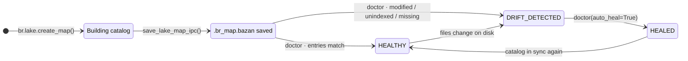

# Binary Lake Map & Lake Doctor

Implemented in `src/engine/map.rs`. The Lake Map stores a pre-compiled Arrow IPC payload in the system file `.br_map.bazan` at the root of the data lake. It contains file metadata for every supported format, Parquet row-group/column-chunk locations, NDJSON/CSV/TSV row-block byte checkpoints, and Arrow IPC/Feather RecordBatch ordinals. Only `.br_map.bazan` is loaded; `.br_map.ipc` is ignored as a legacy sidecar name. Lake Doctor still checks current file metadata on disk to detect drift.

---

## Catalog Lifecycle



- `build_lake_map()` walks the directory (via `discover_data_files`), reads each file's schema/row count and full-file min/max stats for supported numeric/string columns.
- For Parquet, the builder also reads the footer and records each row group's row range, compressed byte range, and per-column chunk ranges. This is metadata work; it does not create one byte offset per logical row.
- For NDJSON, the builder records 64K-row blocks with their first logical row, first byte, and byte length. It does not create one byte offset per line.
- For Arrow IPC/Feather, the builder records each RecordBatch ordinal and row range. Reading uses Arrow IPC's native random-access batch index rather than a per-row byte offset.
- For CSV, the builder scans quote-aware record boundaries and records 64K-row blocks. Checkpoints never split a quoted field or an embedded newline.
- `save_lake_map_ipc()` serializes the map; `load_lake_map_ipc()` reads it back through a memory map.

## On-Disk Schema

| Column | Arrow Type | Description |
| :--- | :--- | :--- |
| `rel_path` | `Utf8` | Path relative to the lake root |
| `size_bytes` | `UInt64` | File size |
| `mtime_ms` | `Int64` | Modification time in **milliseconds** since Unix epoch |
| `total_rows` | `UInt64` | Row count |
| `stats_json` | `Utf8` | JSON blob: per-column `{min, max, min_str, max_str}` plus row count |
| `first_global_row` | `UInt64` | Starting row when files are ordered by relative path |
| `row_groups_json` | `Utf8` | Parquet row-group, NDJSON/CSV/TSV row-block, or Arrow IPC/Feather RecordBatch locations; `[]` for other formats |

The aggregate struct also carries `total_files`, `total_rows`, `total_bytes`.

## Location Resolution

For a healthy Parquet entry, `slice_rows` and `slice_cols` resolve the row-group ranges, select only the intersecting row groups, and pass their ordinals to the Parquet reader. For healthy NDJSON, CSV, and TSV entries, they seek to the quote-safe block containing the requested row and parse forward from that checkpoint. For a healthy Arrow IPC/Feather entry, they resolve the containing RecordBatch and call Arrow IPC's random-access index before reading forward. When the source contains a Parquet OffsetIndex, the map records page locations and the reader can skip pages before the requested offset. `br.lake.locate_row()` exposes the global-row resolution without decoding data. A missing or stale map falls back to the normal streaming reader; it is never used to read a modified file.

---

## Lake Doctor

`doctor_lake_map(dir_path, auto_heal)` compares the on-disk reality against the catalog:

| Report field | Meaning |
| :--- | :--- |
| `status` | `"HEALTHY"` \| `"DRIFT_DETECTED"` \| `"HEALED"` |
| `total_files` | Files seen on disk |
| `healthy_count` | Entries matching the catalog exactly (path + size + mtime) |
| `modified_files` | Known paths whose size/mtime changed |
| `unindexed_files` | New files missing from the catalog |
| `missing_files` | Indexed files no longer on disk |
| `healed` | Whether healing ran |

**Healing** rebuilds the entry list from what still exists (dropping `missing_files`, refreshing stats for modified/unindexed entries) and rewrites `.br_map.bazan`. Any file inspection error aborts the operation instead of producing a partial catalog. Status becomes `"HEALED"`. Without `auto_heal=True` the report is purely diagnostic.

```python
import basaltic_red as br

report = br.lake.doctor("data", auto_heal=False)
if report["status"] != "HEALTHY":
    report = br.lake.doctor("data", auto_heal=True)
```

Full command signatures: [`br.lake.*`](../reference/python-api.md#basaltic_redlake) · binary layout details: [Lake Map Specification](../reference/lake-map-spec.md).
