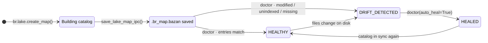

# Binary Lake Map & Lake Doctor

Implemented in `src/engine/map.rs`. The Lake Map stores a pre-compiled Arrow IPC payload in the system file `.br_map.bazan` at the root of the data lake. It contains file metadata for every supported format, Parquet row-group/column-chunk, ORC stripe, Avro OCF block, MsgPack object-block locations, XLSX logical row blocks, NDJSON/JSONL and JSON-array object-block checkpoints, CSV/TSV/PSV/TXT row-block byte checkpoints, and Arrow IPC/Feather RecordBatch ordinals. Only `.br_map.bazan` is loaded; `.br_map.ipc` is ignored as a legacy sidecar name. Lake Doctor still checks current file metadata on disk to detect drift.

---

## Catalog Lifecycle



- `build_lake_map()` walks the directory (via `discover_data_files`), reads each file's schema/row count and full-file min/max stats. Supported types and numeric precision are listed in the [Lake Map specification](../reference/lake-map-spec.md#aggregate-totals).
- Row-oriented checkpoint spacing is configurable with `checkpoint_stride_rows` when creating a map; it defaults to `65,536` and must be greater than zero. For example, `br.lake.create_map("data", checkpoint_stride_rows=16_384)`. The setting affects NDJSON/JSON line and array checkpoints, delimited files, MsgPack blocks, and XLSX logical row blocks. It does not split native Parquet row groups, ORC stripes, Avro OCF blocks, or Arrow IPC batches.
- Lake Map creation and Lake Doctor share that extension-based discovery set: built-in extensions and currently registered dynamic extensions are included, while extensionless files are excluded. A file can still be read directly by magic-byte sniffing, but it is outside map/doctor directory scope. Dynamic handlers must be registered for map creation and doctor runs; without one, its files are not discovered and existing entries appear missing (auto-heal removes them from the map).
- For Parquet, the builder also reads the footer and records each row group's row range, compressed byte range, and per-column chunk ranges. This is metadata work; it does not create one byte offset per logical row.
- For NDJSON, the builder records row blocks at the configured stride with their first logical row, first byte, and byte length. It does not create one byte offset per line.
- For `.json` and `.jsonl`, the first non-whitespace byte selects the map locator: `[` records top-level array-object blocks at the configured stride; otherwise the map records line checkpoints at that stride. The array scanner tracks nesting, quoted strings, and escapes. `.ndjson` always uses line checkpoints.
- For ORC, the builder records each stripe's ordinal, row range, byte offset, and physical stripe size from ORC footer metadata. Slicing uses ORC's native byte-range reader to skip earlier stripes.
- For Avro, the builder parses the Object Container File header and records every data block's row range, block offset, physical block size, and compressed payload size. Slicing replays the header and seeks the Avro reader to the selected block.
- For MsgPack, the builder decodes top-level objects only to find object-block boundaries at the configured stride and records their byte checkpoints. Slicing infers the schema from the first map, seeks to the selected checkpoint, and decodes forward.
- For XLSX, the builder records logical data-row blocks at the configured stride for the first worksheet. XLSX worksheet XML is normally Deflate-compressed inside a ZIP entry, so these checkpoints have no physical byte offset; slicing starts `XlsxRows` at the selected logical block, while Calamine still materializes the worksheet range first.
- For Arrow IPC/Feather, the builder records each RecordBatch ordinal and row range. Reading uses Arrow IPC's native random-access batch index rather than a per-row byte offset.
- For CSV, the builder scans quote-aware record boundaries and records row blocks at the configured stride. Checkpoints never split a quoted field or an embedded newline; the same scanner is used for TSV, PSV, and semicolon-separated TXT.
- `save_lake_map_ipc()` serializes the map; `load_lake_map_ipc()` reads it back through a memory map.

## On-Disk Schema

| Column | Arrow Type | Description |
| :--- | :--- | :--- |
| `rel_path` | `Utf8` | Path relative to the lake root |
| `size_bytes` | `UInt64` | File size |
| `mtime_ms` | `Int64` | Modification time in **milliseconds** since Unix epoch |
| `total_rows` | `UInt64` | Row count |
| `stats_json` | `Utf8` | JSON blob: per-column `{min, max, min_str, max_str}` plus row count |
| `first_global_row` | `UInt64` | Starting row when files are ordered by relative path |
| `row_groups_json` | `Utf8` | Parquet row-group, ORC stripe, Avro OCF block, MsgPack object block, XLSX logical row block, NDJSON/JSONL/JSON-array and CSV/TSV/PSV/TXT row-block, or Arrow IPC/Feather RecordBatch locations; `[]` for other formats |
| `content_hash` | `Utf8` (nullable) | BLAKE3 digest when the map was built with `fingerprint="blake3"`; null otherwise |

The aggregate struct also carries `total_files`, `total_rows`, `total_bytes`. The chosen checkpoint stride and fingerprint policy are stored in the Arrow schema metadata.

## Location Resolution

For a healthy Parquet entry, `slice_rows` and `slice_cols` resolve the row-group ranges and pass only intersecting row groups to the reader. If the source has an OffsetIndex, the Parquet Arrow reader can use the index loaded from that source to skip pages within the selected groups; page locations serialized in the map are not passed to the reader. Mapped `slice_cols` pushes selected columns into Parquet, Arrow IPC/Feather, and ORC readers. Mapped delimited readers apply selected columns while parsing, but still read each selected record's bytes to find field boundaries. Other row readers (Avro, MsgPack, JSON-family, and XLSX) decode the selected rows before projecting columns.

For healthy ORC entries, slicing seeks to the containing stripe byte offset and lets the ORC reader process that stripe and later stripes. For Avro entries, it replays the OCF header, seeks to the containing block byte offset, and decodes forward. MsgPack slicing seeks to the containing object-block checkpoint and decodes forward using the first-map schema. XLSX slicing starts `XlsxRows` at the containing logical row block, but Calamine has already materialized the first worksheet, so this is not a physical ZIP byte seek.

NDJSON uses line checkpoints. `.json` and `.jsonl` use array-object checkpoints when the first non-whitespace byte is `[` and line checkpoints otherwise. Delimited formats seek to quote-safe row checkpoints. Arrow IPC/Feather resolves the containing RecordBatch through Arrow IPC's native batch index. These block, stripe, row-group, and batch locators still require the reader to decode rows forward within the selected range. `br.lake.locate_row()` resolves a global row from the saved map without decoding source data, but does not check whether that map is fresh. Run Lake Doctor after source files are added, removed, or changed; use BLAKE3 fingerprinting and Doctor when same-size, same-mtime content changes must be detected. Slice freshness checks compare file size and modification time; slices do not rehash the full file. A dynamic handler override uses that registered handler with no built-in locator; a missing or stale map falls back to the normal reader and is never used to read a file whose checked metadata changed.

---

## Lake Doctor

`doctor_lake_map(dir_path, auto_heal)` compares the on-disk reality against the catalog:

| Report field | Meaning |
| :--- | :--- |
| `status` | `"HEALTHY"` \| `"DRIFT_DETECTED"` \| `"HEALED"` |
| `total_files` | Files seen on disk |
| `healthy_count` | Entries matching the catalog checks (path + size + mtime; content hash too when `fingerprint="blake3"`) |
| `modified_files` | Known paths that fail the configured freshness checks (size/mtime, plus BLAKE3 when enabled) |
| `unindexed_files` | New files missing from the catalog |
| `missing_files` | Indexed files no longer on disk |
| `healed` | Whether healing ran |

With the default `fingerprint="metadata"`, drift classification compares discovered path, size, and modification time; it does not detect same-size content changes that preserve the recorded modification time. With `fingerprint="blake3"`, Lake Doctor also verifies each stored BLAKE3 content hash. Slice resolution checks path, size, and modification time only; it does not hash the full source file. With `auto_heal=True`, modified and new files are reread to rebuild map entries. `HEALTHY` means the configured checks match, not that the file matches an external content-integrity baseline.

**Healing** rebuilds the entry list from what still exists (dropping `missing_files`, refreshing stats for modified/unindexed entries) and rewrites `.br_map.bazan`. Any file inspection error aborts the operation instead of producing a partial catalog. Status becomes `"HEALED"`. Without `auto_heal=True` the report is purely diagnostic.

```python
import basaltic_red as br

report = br.lake.doctor("data", auto_heal=False)
if report["status"] != "HEALTHY":
    report = br.lake.doctor("data", auto_heal=True)
```

Full command signatures: [`br.lake.*`](../reference/python-api.md#basaltic_redlake) · binary layout details: [Lake Map Specification](../reference/lake-map-spec.md).
