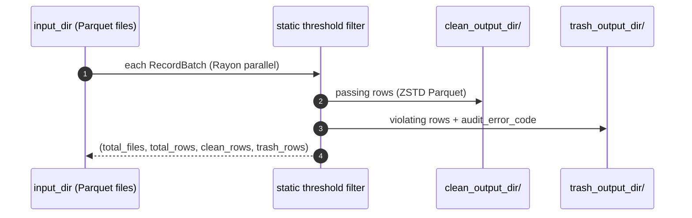

# Lakehouse Pipeline

The write-side modules of `src/engine/`: `ingest.rs`, `splitter.rs`, `formats/core/parquet.rs` (lake + gold writers), `partition.rs`, and `memory.rs`.

---

## Ingest (`br.lake.ingest`)

Copies a source directory into a destination lake, preserving relative layout:

- Row-based formats (`csv, tsv, psv, txt, json, jsonl, ndjson, msgpack, xlsx`) are **converted to Parquet** when normalization is on, either via `auto_normalize=True` or the `BR_INGEST_NORMALIZE=1` environment variable.
- Everything else is copied byte-for-byte.

Returns `(files_ingested, rows_ingested)`.

## Split (`br.lake.split_file`)

`split_file_native()` streams a file and writes fixed-size parts:

```python
n = br.lake.split_file("big.csv", max_rows_per_file=100_000,
                       output_dir="./parts", format="parquet")  # → number of parts
```

Output format can be any writable extension (e.g. `parquet`, `csv`). Parts are named `<stem>_part_NNN.<format>`.

## Clean/Trash Lake Write (`br.lake.process_and_write_lake`)

Reads every **Parquet** file under `input_dir` in parallel (optionally narrowed by a Hive-style `partition_filter`), applies the **static** quality thresholds per batch, and writes two Parquet trees that mirror the input's relative layout:



Returns `(total_files, total_rows, clean_rows, trash_rows)`. Trash files carry the same [`audit_error_code`](simd-kernel.md#audit-columns-on-the-trash-table) column as dynamic filtering. All parts are written with ZSTD compression; batch size adapts to the number of concurrent files.

## Gold Table (`br.lake.generate_gold_table`)

Reads a clean **Parquet** directory back and republishes it as a versioned table:

```python
files, gold_rows, manifest = br.lake.generate_gold_table(
    "clean/", "gold/", table_version="v1",
)
```

- Output paths mirror `clean/`'s relative layout under `gold/` (ZSTD compressed).
- Writes `_gold_metadata.json` next to the data: table name, version, creation epoch, total files/rows.
- Returns `(total_files_read, gold_rows_written, manifest_path)`.

---

## Memory Budget & Runtimes

All streaming reads/writes share one budget from `src/engine/memory.rs`:

| Mechanism | Value |
| :--- | :--- |
| Per-stream row ceiling | `BUDGET_BATCH_ROWS = 1 << 20` |
| Parallel scaling | each of N streams gets `budget_batch_rows(N)` rows |
| Total RAM cap | `BASALTIC_RED_MAX_RAM_GB` env var, default **2 GB** |
| Safety factor | ×3.5 for transient mask/clean/trash buffers |

Two process-wide runtimes are created lazily: a multi-threaded tokio runtime (`global_runtime()`, used by DataFusion streams) and a sized Rayon pool (`global_rayon_pool(threads)`). Internally, `budget_batch_rows(parallel_streams)` dynamically sizes per-stream buffers to stay within the total memory budget.
