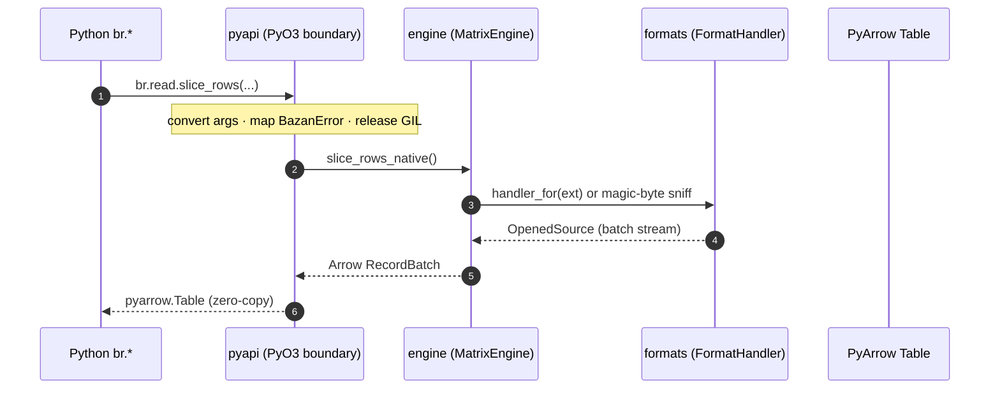

# Architecture Overview

`basaltic-red` is a single Rust crate compiled as a Python extension (`cdylib`) via [PyO3](https://pyo3.rs) + Maturin. Every public Python command routes through one shared engine instance into specialized Rust modules.

---

## Project Map

Each component page names its source files inline. The table below is the entry map; the live tree always lives in the [GitHub repo browser](https://github.com/VanDung-dev/basaltic-red/tree/master/src).

| Component | Location under `src/` | Responsibility | Docs |
| :--- | :--- | :--- | :--- |
| Module entry | `lib.rs` | Registers submodules & classes (`#[pymodule]`) | — |
| Error taxonomy | `error.rs` | `BazanError` variants mapped to Python exceptions | [MatrixEngine Core](matrix-engine.md) |
| File discovery | `utils.rs` | Recursive, partition-aware file walkers | [Filtering Pipeline](filtering-pipeline.md) |
| Static filter flags | `filter.rs` | Fixed-threshold audit bit flags | [MatrixEngine Core](matrix-engine.md#static-vs-dynamic-filtering) |
| Python boundary | `pyapi/` | `br.*` namespaces, argument conversion, GIL release, shared engine | [Python API Reference](../reference/python-api.md) |
| Engine core | `engine/mod.rs` | `MatrixEngine` struct + quality thresholds | [MatrixEngine Core](matrix-engine.md) |
| Dynamic kernel | `engine/dynamic_filter.rs` | Rule parsing + multi-chunk bitmask evaluation | [SIMD Bitmask Kernel](simd-kernel.md) |
| Slicing | `engine/slice.rs` | Zero-copy row/column reads, sample preview | [MatrixEngine Core](matrix-engine.md#slicing-primitives) |
| Parallel filter | `engine/parallel_filter.rs`, `engine/partition.rs` | Rayon multi-file filtering, Hive-style pruning | [Filtering Pipeline](filtering-pipeline.md) |
| Format layer | `engine/formats/` | `FormatHandler` trait, registries, magic-byte sniffer | [Format Registry & Sniffing](formats.md) |
| SQL layer | `engine/sql.rs`, `pyapi/iterator.rs` | DataFusion session, `PyBatchIterator` bridge | [DataFusion SQL Layer](datafusion.md) |
| Lake map | `engine/map.rs` | `.br_map.ipc` catalog + Lake Doctor | [Lake Map & Lake Doctor](lake-map.md) |
| Write pipeline | `engine/ingest.rs`, `engine/splitter.rs`, `engine/formats/core/parquet.rs` | Ingest, split, clean/trash lake write, gold table | [Lakehouse Pipeline](lakehouse-pipeline.md) |
| Memory & runtimes | `engine/memory.rs` | RAM budget, global tokio/Rayon runtimes | [Lakehouse Pipeline](lakehouse-pipeline.md#memory-budget-runtimes) |
| Extras | `engine/csv_guard.rs`, `engine/graph.rs`, `engine/recommend.rs` | CSV injection guard, Mermaid ER diagrams, batch-size hint | — |

---

## Layered Execution Flow



1. **Python boundary (`pyapi/`)** — converts arguments, maps [`BazanError`](matrix-engine.md#error-taxonomy) to `PyValueError` / `PyRuntimeError` / `PyIOError`, and releases the GIL around native work via `py.detach`.
2. **Engine core (`engine/`)** — owns all logic: format resolution, streaming reads, filtering, SQL planning.
3. **Format layer (`formats/`)** — every file access resolves to a `FormatHandler` (extension lookup first, then magic-byte sniffing).
4. **Interop boundary** — results cross back as PyArrow objects through Arrow's zero-copy interface; see [DataFusion SQL Layer](datafusion.md).

---

## Shared Engine Instance

All namespaced commands use one process-wide engine built by `default_engine()` in `src/pyapi/mod.rs`:

```rust
static DEFAULT_ENGINE: OnceLock<MatrixEngine> = OnceLock::new();
// MatrixEngine::new(1, 9, 0.01, 100.0) — default quality thresholds
```

This guarantees identical validation thresholds across `br.read.*`, `br.filter.*`, `br.lake.*`, ... Custom thresholds are available by instantiating `br.MatrixEngine(min_passenger, max_passenger, min_fare, max_speed_mph)` directly.

---

## Memory Model

- Streaming reads are capped at `BUDGET_BATCH_ROWS = 1 << 20` rows per batch per stream.
- With N parallel streams each batch shrinks so total in-flight rows stay bounded — total RAM defaults to **2 GB**, tunable via the `BASALTIC_RED_MAX_RAM_GB` environment variable.
- Details: [Memory Budget & Runtimes](lakehouse-pipeline.md#memory-budget-runtimes) and `src/engine/memory.rs`.
