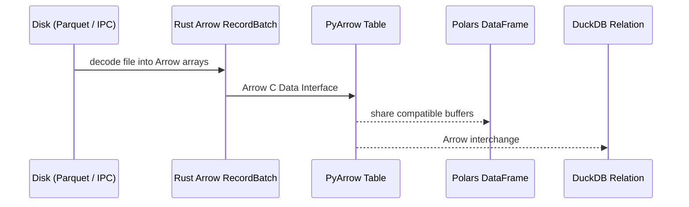

# Core Concepts

Understanding the foundational building blocks of `basaltic-red`.

---

## 1. Apache Arrow Interchange

`basaltic-red` uses Apache Arrow's standard in-memory columnar format across its operations. File readers decode Parquet, IPC, and other supported formats into Arrow `RecordBatch` values; reading compressed or encoded files is not zero-copy from disk. At the Rust/Python boundary, Arrow's C Data Interface can transfer compatible Arrow buffers without copying. Downstream libraries may still copy when a conversion or unsupported layout requires it.

---

## 2. Multi-Chunk SIMD Bitmask Engine

Traditional filtering evaluates rules row-by-row or creates intermediate boolean masks in memory. `basaltic-red` evaluates rules directly into bitwise memory buffers (`Vec<u64>`), updating bit flags in-place.
- **Arbitrary rule counts**: Supports >64 rules directly across multiple 64-bit chunks.
- **Bitwise Audit Codes**: Every rejected record in the Trash table is tagged with `audit_error_code`, a `UInt64` bitmask whose bit *i* marks rule *i* as violated. With more than 64 rules an additional `audit_violated_rules` list column records every violated index.

---

## 3. Binary Lake Map (`.br_map.bazan`) & Lake Doctor

Rather than rebuilding row counts and statistics from scratch, `basaltic-red` maintains an Arrow IPC binary catalog (`.br_map.bazan`) inside the lake directory:
- Contains relative paths, sizes, modification times, row counts, and per-column min/max stats.
- Loading an existing catalog uses `memmap2` (about 0.5 ms in the recorded `demo.ipynb` run; actual time depends on hardware/filesystem). Doctor still discovers current files and checks their path, size, and modification time.
- `br.lake.doctor` detects discovered unindexed, modified, and missing files and can reindex the catalog. Its drift comparison uses path, size, and modification time rather than file-content hashes; healing rereads new or modified files to rebuild map entries.
