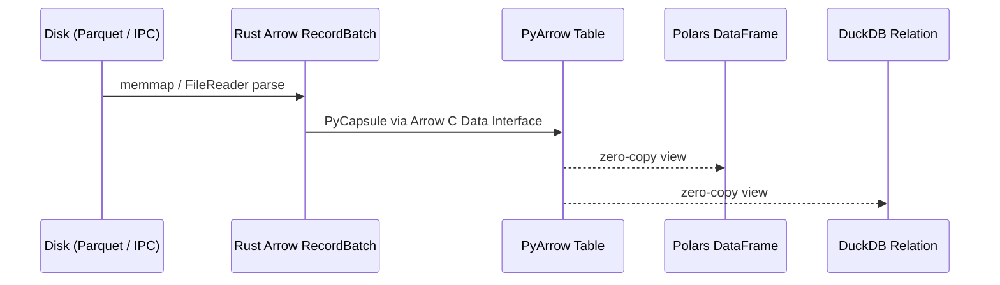

# Core Concepts

Understanding the foundational building blocks of `basaltic-red`.

---

## 1. Zero-Copy Apache Arrow Architecture

`basaltic-red` uses Apache Arrow's standard in-memory columnar format across all operations. When data is read from Parquet or IPC files, raw byte buffers are parsed directly into Arrow `RecordBatch` structures. When handing data off to Python libraries (Polars, PyArrow, DuckDB), pointer transfers via the Arrow C Data Interface prevent redundant memory copying.

---

## 2. Multi-Chunk SIMD Bitmask Engine

Traditional filtering evaluates rules row-by-row or creates intermediate boolean masks in memory. `basaltic-red` evaluates rules directly into bitwise memory buffers (`Vec<u64>`), updating bit flags in-place.
- **Arbitrary rule counts**: Supports >64 rules directly across multiple 64-bit chunks.
- **Bitwise Audit Codes**: Every rejected record in the Trash table is tagged with `audit_error_code`, a `UInt64` bitmask whose bit *i* marks rule *i* as violated. With more than 64 rules an additional `audit_violated_rules` list column records every violated index.

---

## 3. Binary Lake Map (`.br_map.ipc`) & Lake Doctor

Rather than performing recursive filesystem walks across thousands of files on every query, `basaltic-red` maintains an Arrow IPC binary map (`.br_map.ipc`) inside the lake directory:
- Contains relative paths, sizes, modification times, row counts, and per-column min/max stats.
- Warm reads via `memmap2` (sub-millisecond in `demo.ipynb`; actual time depends on hardware/filesystem).
- `br.lake.doctor` detects drift (unindexed, modified, missing files) and incrementally heals the catalog.
