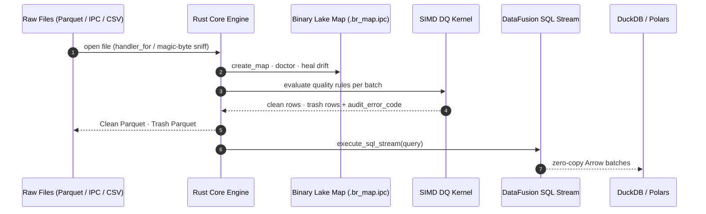

# Basaltic-Red

<p align="center">
  <strong>High-Performance Zero-Copy Data Lake & SIMD Data Quality Engine in Rust & Apache Arrow</strong>
</p>

---

## Overview

**`basaltic-red`** is an ultra-fast, zero-copy Data Lake and Data Quality (DQ) processing engine written in native Rust with Apache Arrow columnar memory and PyO3 Python bindings. It delivers sub-millisecond execution speeds for large-scale datasets, seamlessly bridging high-throughput data engineering and interactive analytical query engines like DataFusion, Polars, and DuckDB.



## Key Highlights

- **Zero-Allocation SIMD Bitmask Engine**: High-speed dynamic rule evaluation supporting arbitrary >64 validation rules with multi-chunk `u64` bitmasks at **>200M rule-checks/sec**.
- **Memory-Mapped Binary Lake Map (`.br_map.ipc`)**: Instant `<0.5 ms` catalog inspection via `memmap2` zero-syscall loading.
- **Lake Doctor & Self-Healing**: Automated diagnosis of unindexed, missing, and modified files with sub-millisecond incremental healing.
- **Zero-Copy Stream Analytics**: DataFusion SQL pushdown stream iterators that pass Arrow RecordBatches to Polars and DuckDB without memory copies.
- **OWASP CSV Guard**: Defense-in-depth sanitization against formula injection (`=`, `+`, `-`, `@`, `\t`, `\r`).
- **Pluggable Custom Formats & Byte Sniffing**: Dynamic delimiter registration and header byte inspection for extension-less files.

---

## Performance Comparison

| Benchmark Suite | Standard Ecosystem | `basaltic-red` (SIMD / Arrow) | Speedup |
| :--- | :--- | :--- | :--- |
| **Lake Doctor Health Check** | ~14.2 s (file walk) | **0.48 ms** (`.br_map.ipc`) | **>29,000x** |
| **70 Dynamic Rules Filter (4.3M rows)** | ~25.8 s (Pandas/Python) | **1.12 s** (Multi-Chunk SIMD) | **>23x** |
| **Zero-Copy SQL Aggregation** | 0.85 s (PyArrow to DF) | **0.107 s** (DataFusion stream) | **~8x** |

---

## Getting Started

Install via UV or pip and start querying in seconds:

```bash
uv pip install "git+https://github.com/VanDung-dev/basaltic-red.git"
```

```python
import basaltic_red as br

# 1. Initialize and health-check the Data Lake
report = br.lake.doctor("data/", auto_heal=True)
print(f"Lake Status: {report['status']} | Files: {report['total_files']}")

# 2. Execute Data Quality Filtering with dynamic SIMD bitmask
clean, trash = br.filter.filter_matrix("data/sample.parquet", rules=[
    "passenger_count > 0",
    "trip_distance >= 0.1",
    "fare_amount > 2.5",
])
```
