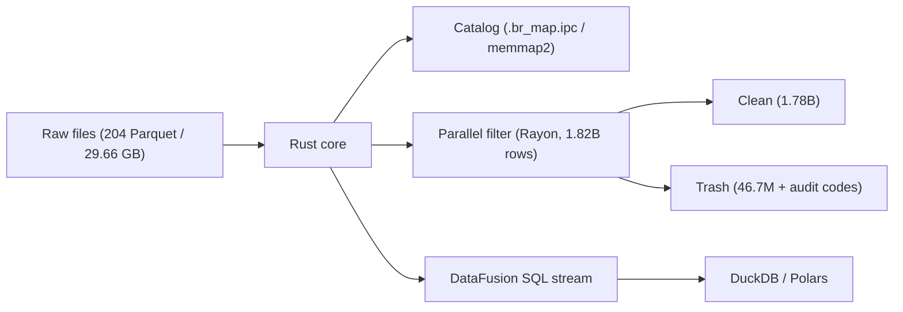

# Basaltic-Red

<p align="center">
  <strong>Zero-copy Data Lake and data-quality engine in Rust + Apache Arrow (Python via PyO3)</strong>
</p>

---

## Overview

`basaltic-red` is a Rust core for file-based data lakes with a thin Python layer. It provides: a memory-mapped catalog (`.br_map.ipc`), row/column slicing without full reads, parallel quality filtering with per-row audit codes, and DataFusion SQL over Arrow batches. Results are `pyarrow.Table` / `RecordBatch` for downstream use with Polars, DuckDB, pandas.

Demo in [`demo.ipynb`](https://github.com/VanDung-dev/basaltic-red/blob/master/demo.ipynb): **NYC TLC Yellow Taxi 2009–2025 — 204 Parquet files, 29.66 GB, 1,826,960,642 rows × 20 columns**.



## What it does

- **Catalog (`.br_map.ipc`)**: one Arrow IPC file at the lake root; warm reads via `memmap2` avoid a directory walk. Doctor reports `HEALTHY` / `DRIFT_DETECTED` / `HEALED`.
- **Slicing**: `slice_rows` / `slice_cols` read only the requested rows/columns.
- **Filtering**: dynamic rules (`col op value`, `op ∈ {>=, <=, ==, !=, >, <}`) evaluated per batch; trash rows carry `audit_error_code` (`u64` bitmask, chunked for >64 rules) and `audit_violated_rules` when needed.
- **SQL**: DataFusion session; `execute_sql_stream` returns a `PyBatchIterator` whose `to_pyarrow()` hands batches to Polars/DuckDB without an extra copy.
- **Formats**: pluggable delimited formats via `br.formats.register_delimited`; extension-less files handled by magic-byte sniffing.

---

## Demo measurements

Single run of `demo.ipynb` on Apple Silicon / macOS. Hardware-dependent — indicative only.

| Scenario | Scope | Observed |
| :--- | :--- | :--- |
| Catalog cold vs warm | 204 files | Cold build ~18.07 s → warm ~0.5 ms (avg 5 runs) |
| Volume scan (metadata only) | 1,826,960,642 rows | < 1 s (~0.7 s) |
| Full-lake filter (5 rules) | 1,826,960,642 rows | ~21 s (1,780,228,507 clean / 46,732,135 trash) |
| Single-file SQL `GROUP BY` | 4,305,006 rows | ~0.1 s |

Filtering loops are plain Rust over Arrow arrays; LLVM auto-vectorizes them. No hand-written SIMD intrinsics.

---

## Getting started

```bash
uv add "git+https://github.com/VanDung-dev/basaltic-red.git"
```

```python
import basaltic_red as br

report = br.lake.doctor("data/", auto_heal=True)
print(report["status"], report["total_files"])

clean, trash = br.filter.filter_matrix("data/sample.parquet", rules=[
    "passenger_count >= 1",
    "trip_distance > 0.0",
    "fare_amount > 0.0",
])
```

Full walkthrough: [Quickstart](getting-started/quickstart.md) · [Lake Doctor](workflows/lake-doctor.md) · [Benchmarks](other/benchmarks.md)
