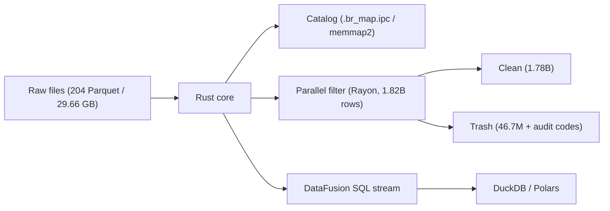

# Basaltic-Red

<p align="center">
  <strong>High-performance Data Lake acceleration & data-quality toolkit in Rust + Apache Arrow (Python via PyO3)</strong>
</p>

---

## Overview

`basaltic-red` is a Rust compute core for file-based data lakes with Python bindings. It provides a memory-mapped catalog (`.br_map.ipc`), row and column slicing without full reads, parallel quality filtering with per-row audit codes, and DataFusion SQL execution over Arrow batches. Results return as `pyarrow.Table` or `RecordBatch` objects for use with Polars, DuckDB, or pandas.

Demo in [`demo.ipynb`](https://github.com/VanDung-dev/basaltic-red/blob/master/demo.ipynb): NYC TLC Yellow Taxi 2009 to 2025, with 204 Parquet files, 29.66 GB, and 1,826,960,642 rows by 20 columns.



## What it does

- Catalog (`.br_map.ipc`): one Arrow IPC file at the lake root; warm reads via `memmap2` avoid traversing directory trees. Doctor reports `HEALTHY`, `DRIFT_DETECTED`, or `HEALED`.
- Slicing: `slice_rows` and `slice_cols` read only the requested rows and columns.
- Filtering: dynamic rules evaluated per batch; invalid rows carry an `audit_error_code` (`u64` bitmask, chunked when rules exceed 64).
- SQL: DataFusion session; `execute_sql_stream` returns a `PyBatchIterator` whose `to_pyarrow()` method hands batches to Polars or DuckDB without copying.
- Formats: custom delimited formats via `br.formats.register_delimited`; extension-less files are identified by magic-byte sniffing.

---

## Demo measurements

Single run of `demo.ipynb` on Apple Silicon / macOS. Hardware dependent, provided for reference.

| Scenario | Scope | Observed |
| :--- | :--- | :--- |
| Catalog cold vs warm | 204 files | Cold build took ~18.07 s; warm read took ~0.5 ms (average of 5 runs) |
| Volume scan (metadata only) | 1,826,960,642 rows | < 1 s (~0.7 s) |
| Full-lake filter (5 rules) | 1,826,960,642 rows | ~21 s (1,780,228,507 clean / 46,732,135 invalid) |
| Single-file SQL `GROUP BY` | 4,305,006 rows | ~0.1 s |

Filtering loops are plain Rust over Arrow arrays, auto-vectorized by LLVM. No hand-written SIMD intrinsics.

---

## Getting started

```bash
uv add "git+https://github.com/VanDung-dev/basaltic-red.git"
```

```python
import basaltic_red as br

report = br.lake.doctor("data/", auto_heal=True)
print(report["status"], report["total_files"])

clean, trash = br.filter.filter_matrix("data/sample.parquet", rules=[
    "passenger_count >= 1",
    "trip_distance > 0.0",
    "fare_amount > 0.0",
])
```

Full walkthrough: [Quickstart](getting-started/quickstart.md) · [Lake Doctor](workflows/lake-doctor.md) · [Benchmarks](other/benchmarks.md)
