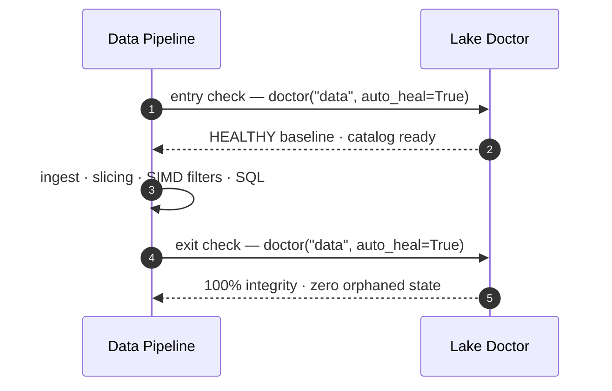

# Lake Doctor & Self-Healing Workflow

## Operational Life Cycle

The Lake Doctor is the mandatory entrypoint and exit point for robust data lake pipelines:



## Example Code

```python
import basaltic_red as br

# Diagnostic run
status = br.lake.doctor("data", auto_heal=False)
if status["status"] != "HEALTHY":
    print("Drift detected! Healing lake...")
    br.lake.doctor("data", auto_heal=True)
```
