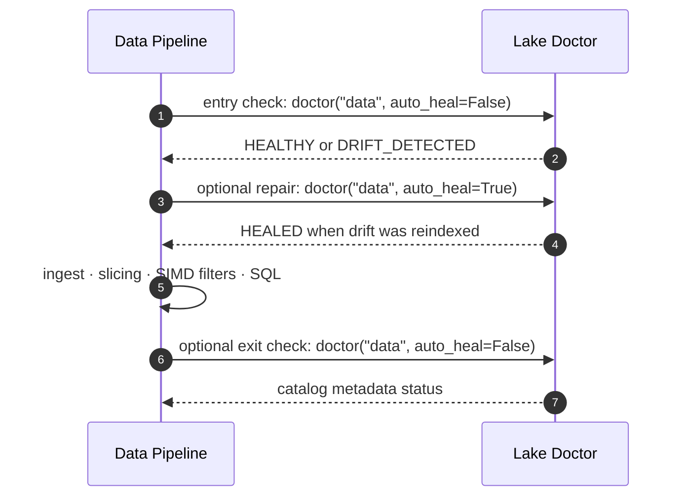

# Lake Doctor & Self-Healing Workflow

## Operational Life Cycle

Use Lake Doctor to check the catalog and optionally repair metadata drift. Its drift comparison discovers files by supported extension and compares path, size, and modification time; it does not checksum bytes or compare file contents against an external baseline. `auto_heal=True` re-inspects modified and new files to rebuild their map entries. Directly readable extensionless files are outside its directory scope. Register dynamic handlers in the process before running it if their extensions should be included.



## Example Code

```python
import basaltic_red as br

# Diagnostic run
status = br.lake.doctor("data", auto_heal=False)
if status["status"] != "HEALTHY":
    print("Drift detected! Healing lake...")
    status = br.lake.doctor("data", auto_heal=True)
```

`HEALED` means this call rebuilt the map entries for the detected drift; run Doctor again to confirm the resulting catalog reports `HEALTHY`. `HEALTHY` only means the discovered file paths, sizes, and modification times match the map; Doctor does not detect same-size content changes that preserve the recorded modification time.

## Content Fingerprint Checks

Maps use `fingerprint="metadata"` by default. To have Doctor detect content changes that preserve both file size and modification time, create the map with BLAKE3 fingerprinting:

```python
br.lake.create_map("data", fingerprint="blake3")
status = br.lake.doctor("data")
if status["status"] != "HEALTHY":
    status = br.lake.doctor("data", auto_heal=True)
```

The map stores its options, and Doctor preserves them when auto-healing, so rebuilt entries continue to use BLAKE3. Slicing does not rehash file contents; run Doctor before slicing when BLAKE3 drift verification is required. If Doctor reports drift, use `auto_heal=True` before relying on the map-backed slice.
