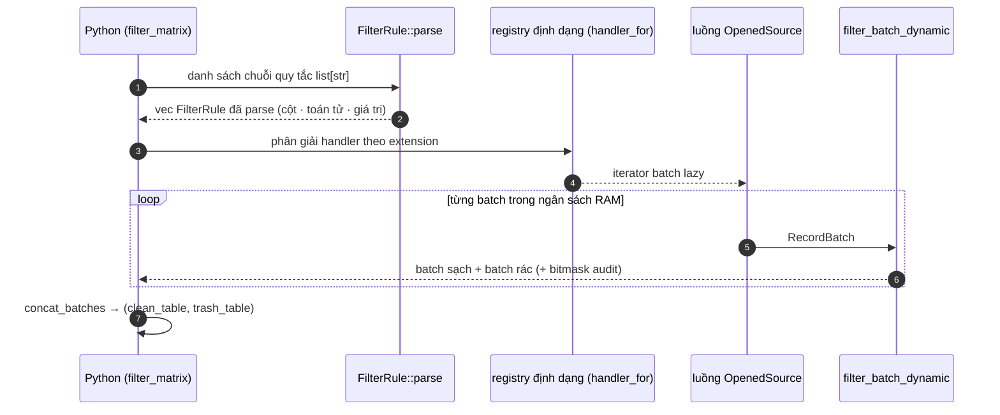

# Đường ống Lọc

Hai điểm vào dùng chung [nhân bitmask](simd-kernel.md):

- `filter_matrix(file_path, rules)` — một tệp, trả về `(clean_table, trash_table)`.
- `filter_files_parallel(path_pattern, rules)` — nhiều tệp qua Rayon, trả về dict tổng kết.

---

## Luồng một tệp (`engine` + `pyapi/engine.rs::filter_matrix`)



Việc lọc chạy theo từng batch nên RAM đỉnh chỉ ở mức [ngân sách batch](#hanh-vi-bo-nho), không phụ thuộc dung lượng tệp.

## Bộ lọc song song đa tệp (`engine/parallel_filter.rs`)

1. **Thu thập đích** — `collect_target_files()` chấp nhận đường dẫn tệp đơn, thư mục (duyệt đệ quy), hoặc glob pattern (`*`, `?`, `[...]`). Thư mục được duyệt có ý thức phân vùng.
2. **Cắt tỉa phân vùng** — với bố cục kiểu Hive (`year=2026/month=08/...`), `parse_path_partitions()` trích cặp key/value từ từng đường dẫn và `matches_partition_rules()` loại cả tệp trước cả khi mở. Có thể truyền bộ lọc tường minh như `"year=2026/month=08"` hoặc quy tắc trên cột phân vùng.
3. **Thực thi Rayon** — các tệp sống sót được lọc trên pool Rayon toàn cục; tham số `num_threads` tuỳ chọn ghi đè độ rộng pool.
4. **Tổng kết** — số liệu được reduce thành dict:

```python
summary = br.filter.filter_files_parallel(
    "data/yellow_tripdata_2025-*.parquet",
    rules=["passenger_count > 0", "fare_amount >= 2.5"],
)
# {
#   "total_files": 12,
#   "pruned_dirs": 0,      # thư mục bị bỏ hẳn nhờ cắt tỉa phân vùng
#   "total_rows": 51_660_072,
#   "clean_rows":  50_112_004,
#   "trash_rows":  1_548_068,
# }
```

!!! note "Chế độ song song không ghi dữ liệu ra"

    `filter_files_parallel` là bước *đếm* — nó báo bao nhiêu dòng sẽ sống sót. Để ghi đầu ra Parquet clean/trash theo thư mục, dùng [`br.lake.process_and_write_lake`](lakehouse-pipeline.md).

---

## Hành vi bộ nhớ

Kích thước batch tự co giãn theo ngân sách RAM: mỗi luồng trong N luồng nhận `budget_batch_rows(N)` dòng để tổng dòng đang bay luôn giới hạn (~2 GB mặc định, chỉnh qua `BASALTIC_RED_MAX_RAM_GB`). Xem `src/engine/memory.rs`.
