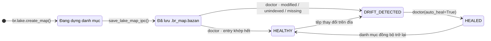

# Binary Lake Map & Lake Doctor

Cài đặt trong `src/engine/map.rs`. Lake Map lưu một payload Arrow IPC đã biên dịch sẵn trong tệp hệ thống `.br_map.bazan` tại gốc hồ dữ liệu. Nó lưu metadata cho mọi định dạng, vị trí row-group/column-chunk của Parquet, stripe ORC, block OCF của Avro, checkpoint byte theo block dòng NDJSON/JSONL, block object của mảng JSON, block dòng CSV/TSV/PSV/TXT và ordinal RecordBatch của Arrow IPC/Feather. Chỉ `.br_map.bazan` được load; `.br_map.ipc` bị bỏ qua như tên sidecar cũ. Lake Doctor vẫn kiểm tra metadata tệp hiện tại trên đĩa để phát hiện drift.

---

## Vòng đời danh mục



- `build_lake_map()` duyệt thư mục (qua `discover_data_files`), đọc schema/số dòng và thống kê min/max toàn file cho các cột số/chuỗi được hỗ trợ.
- Với Parquet, builder còn đọc footer và lưu khoảng dòng, khoảng byte nén của từng row group cùng khoảng byte của từng column chunk. Đây không phải một byte offset cho từng dòng logic.
- Với NDJSON, builder lưu block 64K dòng cùng dòng logic đầu tiên, byte đầu tiên và độ dài byte. Nó không tạo offset cho từng dòng.
- Với `.json`, builder quét một mảng top-level và lưu block 64K object. Scanner hiểu nesting, chuỗi quote và escape để checkpoint luôn bắt đầu tại object hoàn chỉnh.
- Với ORC, builder lấy ordinal, khoảng dòng, byte offset và kích thước stripe từ footer metadata của ORC. Khi slice, reader ORC dùng byte range để bỏ qua các stripe trước đó.
- Với Avro, builder đọc header Object Container File và lưu khoảng dòng, byte offset, kích thước block vật lý và payload nén của từng data block. Khi slice, hệ thống phát lại header rồi seek reader Avro tới block tương ứng.
- Với Arrow IPC/Feather, builder lưu ordinal và khoảng dòng của từng RecordBatch. Khi đọc, hệ thống dùng random access batch index native của Arrow IPC thay vì offset cho từng dòng.
- Với CSV, builder quét ranh giới record có hiểu quote và lưu block 64K dòng. Checkpoint không bao giờ cắt giữa quoted field hoặc newline bên trong field; cùng scanner được dùng cho TSV, PSV và TXT phân cách bằng dấu chấm phẩy.
- `save_lake_map_ipc()` serialize bản đồ; `load_lake_map_ipc()` đọc ngược qua memory map.

## Schema trên đĩa

| Cột | Kiểu Arrow | Mô tả |
| :--- | :--- | :--- |
| `rel_path` | `Utf8` | Đường dẫn tương đối so với gốc lake |
| `size_bytes` | `UInt64` | Dung lượng tệp |
| `mtime_ms` | `Int64` | Thời điểm sửa đổi tính bằng **mili-giây** từ Unix epoch |
| `total_rows` | `UInt64` | Số dòng |
| `stats_json` | `Utf8` | JSON: `{min, max, min_str, max_str}` từng cột kèm số dòng |
| `first_global_row` | `UInt64` | Dòng bắt đầu khi sắp xếp file theo đường dẫn tương đối |
| `row_groups_json` | `Utf8` | Vị trí row group Parquet, stripe ORC, block OCF Avro, block dòng NDJSON/JSONL/JSON-array và CSV/TSV/PSV/TXT hoặc RecordBatch Arrow IPC/Feather; `[]` với định dạng khác |

Struct tổng hợp cũng mang theo `total_files`, `total_rows`, `total_bytes`.

## Phân giải vị trí

Với entry Parquet còn khỏe, `slice_rows` và `slice_cols` tìm các row group giao với khoảng cần đọc, chỉ truyền ordinal của chúng cho Parquet reader, rồi áp dụng offset/limit cục bộ. Với entry ORC còn khỏe, chúng seek tới byte offset của stripe chứa dòng rồi để ORC reader đọc stripe đó và các stripe sau. Với entry Avro còn khỏe, chúng phát lại header OCF, seek tới byte offset của block chứa dòng rồi giải mã block đó và các block sau. Với entry NDJSON/JSONL và JSON-array còn khỏe, chúng seek tới checkpoint chứa dòng/object yêu cầu rồi parse tiếp. Với CSV/TSV/PSV/TXT, chúng seek tới block dòng quote-safe. Với entry Arrow IPC/Feather còn khỏe, chúng tìm RecordBatch chứa dòng rồi gọi random-access index native của Arrow IPC trước khi đọc tiếp. Nếu file Parquet có OffsetIndex, map lưu thêm vị trí page để reader bỏ qua page trước offset. `br.lake.locate_row()` phơi ra phép phân giải global-row mà không giải mã dữ liệu. Map thiếu hoặc map stale sẽ fallback về streaming và không bao giờ được dùng cho file đã thay đổi.

---

## Lake Doctor

`doctor_lake_map(dir_path, auto_heal)` so sánh hiện trạng đĩa với danh mục:

| Trường báo cáo | Ý nghĩa |
| :--- | :--- |
| `status` | `"HEALTHY"` \| `"DRIFT_DETECTED"` \| `"HEALED"` |
| `total_files` | Số tệp thấy trên đĩa |
| `healthy_count` | Entry khớp danh mục hoàn toàn (đường dẫn + dung lượng + mtime) |
| `modified_files` | Đường dẫn đã biết nhưng size/mtime thay đổi |
| `unindexed_files` | Tệp mới chưa có trong danh mục |
| `missing_files` | Entry trong danh mục nhưng tệp không còn trên đĩa |
| `healed` | Có chạy chữa lành hay không |

**Chữa lành** dựng lại danh sách entry từ những gì còn tồn tại (bỏ `missing_files`, làm mới thống kê cho entry modified/unindexed) rồi ghi lại `.br_map.bazan`. Nếu đọc một file lỗi, thao tác dừng thay vì tạo catalog thiếu. Status chuyển thành `"HEALED"`. Không có `auto_heal=True` thì báo cáo thuần túy chẩn đoán.

```python
import basaltic_red as br

report = br.lake.doctor("data", auto_heal=False)
if report["status"] != "HEALTHY":
    report = br.lake.doctor("data", auto_heal=True)
```

Chữ ký đầy đủ: [`br.lake.*`](../reference/python-api.md#basaltic_redlake) · chi tiết bố cục nhị phân: [Đặc tả Lake Map](../reference/lake-map-spec.md).
