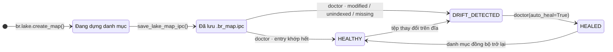

# Binary Lake Map & Lake Doctor

Cài đặt trong `src/engine/map.rs`. Lake Map thay thế việc duyệt đệ quy hệ thống tệp bằng một tệp Arrow IPC đã biên dịch sẵn, `.br_map.ipc`, đặt tại gốc hồ dữ liệu.

---

## Vòng đời danh mục



- `build_lake_map()` duyệt thư mục (qua `discover_data_files`), đọc schema/số dòng và thống kê min/max từng cột.
- `save_lake_map_ipc()` serialize bản đồ; `load_lake_map_ipc()` đọc ngược qua memory map.

## Schema trên đĩa

| Cột | Kiểu Arrow | Mô tả |
| :--- | :--- | :--- |
| `rel_path` | `Utf8` | Đường dẫn tương đối so với gốc lake |
| `size_bytes` | `UInt64` | Dung lượng tệp |
| `mtime_ms` | `Int64` | Thời điểm sửa đổi tính bằng **mili-giây** từ Unix epoch |
| `total_rows` | `UInt64` | Số dòng |
| `stats_json` | `Utf8` | JSON: `{min, max, min_str, max_str}` từng cột kèm số dòng |

Struct tổng hợp cũng mang theo `total_files`, `total_rows`, `total_bytes`.

---

## Lake Doctor

`doctor_lake_map(dir_path, auto_heal)` so sánh hiện trạng đĩa với danh mục:

| Trường báo cáo | Ý nghĩa |
| :--- | :--- |
| `status` | `"HEALTHY"` \| `"DRIFT_DETECTED"` \| `"HEALED"` |
| `total_files` | Số tệp thấy trên đĩa |
| `healthy_count` | Entry khớp danh mục hoàn toàn (đường dẫn + dung lượng + mtime) |
| `modified_files` | Đường dẫn đã biết nhưng size/mtime thay đổi |
| `unindexed_files` | Tệp mới chưa có trong danh mục |
| `missing_files` | Entry trong danh mục nhưng tệp không còn trên đĩa |
| `healed` | Có chạy chữa lành hay không |

**Chữa lành** dựng lại danh sách entry từ những gì còn tồn tại (bỏ `missing_files`, làm mới thống kê cho entry modified/unindexed) rồi ghi lại `.br_map.ipc`. Status chuyển thành `"HEALED"`. Không có `auto_heal=True` thì báo cáo thuần túy chẩn đoán.

```python
import basaltic_red as br

report = br.lake.doctor("data", auto_heal=False)
if report["status"] != "HEALTHY":
    report = br.lake.doctor("data", auto_heal=True)
```

Chữ ký đầy đủ: [`br.lake.*`](../reference/python-api.md#basaltic_redlake) · chi tiết bố cục nhị phân: [Đặc tả Lake Map](../reference/lake-map-spec.md).
