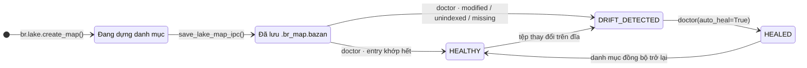

# Binary Lake Map & Lake Doctor

Cài đặt trong `src/engine/map.rs`. Lake Map lưu một payload Arrow IPC đã biên dịch sẵn trong tệp hệ thống `.br_map.bazan` tại gốc hồ dữ liệu. Nó lưu metadata cho mọi định dạng, vị trí row-group/column-chunk của Parquet, stripe ORC, block OCF của Avro, block object MsgPack, block dòng logic XLSX, checkpoint byte theo block dòng NDJSON/JSONL, block object của mảng JSON, block dòng CSV/TSV/PSV/TXT và ordinal RecordBatch của Arrow IPC/Feather. Chỉ `.br_map.bazan` được load; `.br_map.ipc` bị bỏ qua như tên sidecar cũ. Lake Doctor vẫn kiểm tra metadata tệp hiện tại trên đĩa để phát hiện drift.

---

## Vòng đời danh mục



- `build_lake_map()` duyệt thư mục (qua `discover_data_files`), đọc schema/số dòng và thống kê min/max toàn file. Kiểu được hỗ trợ và độ chính xác số được ghi trong [đặc tả Lake Map](../reference/lake-map-spec.md#tong-hop).
- Khoảng cách checkpoint theo dòng cấu hình bằng `checkpoint_stride_rows` khi tạo map; mặc định là `65,536` và phải lớn hơn 0. Ví dụ: `br.lake.create_map("data", checkpoint_stride_rows=16_384)`. Thiết lập này áp dụng cho checkpoint dòng/object NDJSON/JSON, file delimited, block MsgPack và block dòng logic XLSX. Nó không chia nhỏ row group native của Parquet, stripe ORC, block OCF Avro hoặc batch Arrow IPC.
- Tạo Lake Map và Lake Doctor dùng chung tập file được discovery theo extension: gồm extension built-in và dynamic extension đang được đăng ký, bỏ qua file không có extension. Có thể đọc trực tiếp file extensionless bằng magic-byte sniffing, nhưng file đó nằm ngoài phạm vi map/doctor theo thư mục. Dynamic handler cần được đăng ký khi tạo map và chạy doctor; nếu không, file dùng extension đó sẽ không được discovery, entry cũ bị báo thiếu và auto-heal sẽ loại khỏi map.
- Với Parquet, builder còn đọc footer và lưu khoảng dòng, khoảng byte nén của từng row group cùng khoảng byte của từng column chunk. Đây không phải một byte offset cho từng dòng logic.
- Với NDJSON, builder lưu block dòng theo stride đã cấu hình cùng dòng logic đầu tiên, byte đầu tiên và độ dài byte. Nó không tạo offset cho từng dòng.
- Với `.json` và `.jsonl`, byte đầu tiên không phải whitespace chọn locator: `[` lưu block object top-level trong mảng theo stride đã cấu hình; các trường hợp khác lưu checkpoint dòng theo stride đó. Scanner mảng hiểu nesting, chuỗi quote và escape. `.ndjson` luôn dùng checkpoint dòng.
- Với ORC, builder lấy ordinal, khoảng dòng, byte offset và kích thước stripe từ footer metadata của ORC. Khi slice, reader ORC dùng byte range để bỏ qua các stripe trước đó.
- Với Avro, builder đọc header Object Container File và lưu khoảng dòng, byte offset, kích thước block vật lý và payload nén của từng data block. Khi slice, hệ thống phát lại header rồi seek reader Avro tới block tương ứng.
- Với MsgPack, builder decode các object top-level để tìm boundary block theo stride đã cấu hình và lưu checkpoint byte. Khi slice, hệ thống lấy schema từ map đầu tiên, seek tới checkpoint rồi decode tiếp.
- Với XLSX, builder ghi block dòng dữ liệu logic theo stride đã cấu hình cho worksheet đầu tiên. XML worksheet thường được nén Deflate trong ZIP nên checkpoint không có byte offset vật lý; khi slice, `XlsxRows` bắt đầu từ block logic đã chọn, nhưng Calamine vẫn materialize toàn bộ range worksheet trước đó.
- Với Arrow IPC/Feather, builder lưu ordinal và khoảng dòng của từng RecordBatch. Khi đọc, hệ thống dùng random access batch index native của Arrow IPC thay vì offset cho từng dòng.
- Với CSV, builder quét ranh giới record có hiểu quote và lưu block dòng theo stride đã cấu hình. Checkpoint không bao giờ cắt giữa quoted field hoặc newline bên trong field; cùng scanner được dùng cho TSV, PSV và TXT phân cách bằng dấu chấm phẩy.
- `save_lake_map_ipc()` serialize bản đồ; `load_lake_map_ipc()` đọc ngược qua memory map.

## Schema trên đĩa

| Cột | Kiểu Arrow | Mô tả |
| :--- | :--- | :--- |
| `rel_path` | `Utf8` | Đường dẫn tương đối so với gốc lake |
| `size_bytes` | `UInt64` | Dung lượng tệp |
| `mtime_ms` | `Int64` | Thời điểm sửa đổi tính bằng **mili-giây** từ Unix epoch |
| `total_rows` | `UInt64` | Số dòng |
| `stats_json` | `Utf8` | JSON: `{min, max, min_str, max_str}` từng cột kèm số dòng |
| `first_global_row` | `UInt64` | Dòng bắt đầu khi sắp xếp file theo đường dẫn tương đối |
| `row_groups_json` | `Utf8` | Vị trí row group Parquet, stripe ORC, block OCF Avro, block object MsgPack, block dòng logic XLSX, block dòng NDJSON/JSONL/JSON-array và CSV/TSV/PSV/TXT hoặc RecordBatch Arrow IPC/Feather; `[]` với định dạng khác |
| `content_hash` | `Utf8` (nullable) | Digest BLAKE3 khi tạo map với `fingerprint="blake3"`; nếu không thì null |

Struct tổng hợp cũng mang theo `total_files`, `total_rows`, `total_bytes`. Stride checkpoint và chính sách fingerprint đã chọn được lưu trong metadata schema Arrow.

## Phân giải vị trí

Với entry Parquet còn khỏe, `slice_rows` và `slice_cols` tìm row group giao với khoảng cần đọc rồi truyền các group đó cho reader. Nếu file nguồn có OffsetIndex, Parquet Arrow reader có thể dùng index nạp từ file để bỏ qua page bên trong các group được chọn; page location đã serialize trong map không được truyền vào reader. Mapped `slice_cols` chuyển cột được chọn xuống Parquet, Arrow IPC/Feather và ORC reader. Reader delimited trên đường mapped áp dụng cột được chọn khi parse, nhưng vẫn phải đọc byte của từng record được chọn để tìm ranh giới field. Các row reader khác (Avro, MsgPack, họ JSON và XLSX) decode các dòng được chọn trước rồi mới project cột.

Slice ORC seek tới byte offset của stripe chứa dòng rồi để ORC reader đọc stripe đó và các stripe sau. Slice Avro phát lại header OCF, seek tới byte offset của block chứa dòng rồi decode tiếp. Slice MsgPack seek tới checkpoint block object và decode tiếp bằng schema từ map đầu tiên. Slice XLSX bắt đầu `XlsxRows` tại block dòng logic chứa offset, nhưng Calamine đã materialize worksheet đầu tiên nên đây không phải seek byte vật lý trong ZIP.

NDJSON dùng checkpoint dòng. `.json` và `.jsonl` dùng checkpoint object mảng khi byte đầu tiên không phải whitespace là `[` và dùng checkpoint dòng trong các trường hợp khác. Định dạng Delimited seek tới checkpoint dòng hiểu quote. Arrow IPC/Feather tìm RecordBatch chứa dòng qua native batch index. Các locator block, stripe, row-group và batch này vẫn cần reader decode tiếp các dòng trong range được chọn. `br.lake.locate_row()` phân giải global-row từ map đã lưu mà không decode dữ liệu nguồn, nhưng không kiểm tra map còn mới hay không. Hãy chạy Lake Doctor sau khi thêm, xóa hoặc sửa file nguồn; dùng fingerprint BLAKE3 cùng Doctor nếu cần phát hiện nội dung đổi nhưng giữ nguyên dung lượng và mtime. Khi resolve slice, hệ thống chỉ so size và mtime; không hash lại toàn bộ tệp. Dynamic handler override dùng handler đã đăng ký và không có locator built-in; map thiếu hoặc stale sẽ fallback về reader thông thường và không dùng map nếu metadata được kiểm tra cho thấy tệp đã thay đổi.

---

## Lake Doctor

`doctor_lake_map(dir_path, auto_heal)` so sánh hiện trạng đĩa với danh mục:

| Trường báo cáo | Ý nghĩa |
| :--- | :--- |
| `status` | `"HEALTHY"` \| `"DRIFT_DETECTED"` \| `"HEALED"` |
| `total_files` | Số tệp thấy trên đĩa |
| `healthy_count` | Entry khớp các kiểm tra catalog (đường dẫn + dung lượng + mtime; thêm content hash nếu `fingerprint="blake3"`) |
| `modified_files` | Đường dẫn đã biết nhưng không đạt kiểm tra freshness đã cấu hình (size/mtime, và BLAKE3 nếu bật) |
| `unindexed_files` | Tệp mới chưa có trong danh mục |
| `missing_files` | Entry trong danh mục nhưng tệp không còn trên đĩa |
| `healed` | Có chạy chữa lành hay không |

Với `fingerprint="metadata"` mặc định, phân loại drift so sánh đường dẫn đã discovery, dung lượng và thời gian sửa đổi; không phát hiện đổi nội dung cùng dung lượng nếu mtime được giữ nguyên. Với `fingerprint="blake3"`, Lake Doctor cũng xác minh BLAKE3 content hash đã lưu. Slice chỉ kiểm tra đường dẫn, dung lượng và mtime; không hash toàn bộ file nguồn. Khi `auto_heal=True`, file mới và file đã sửa được đọc lại để dựng entry map. `HEALTHY` nghĩa là các kiểm tra đã cấu hình đều khớp, không phải baseline bảo đảm toàn vẹn nội dung bên ngoài.

**Chữa lành** dựng lại danh sách entry từ những gì còn tồn tại (bỏ `missing_files`, làm mới thống kê cho entry modified/unindexed) rồi ghi lại `.br_map.bazan`. Nếu đọc một file lỗi, thao tác dừng thay vì tạo catalog thiếu. Status chuyển thành `"HEALED"`. Không có `auto_heal=True` thì báo cáo thuần túy chẩn đoán.

```python
import basaltic_red as br

report = br.lake.doctor("data", auto_heal=False)
if report["status"] != "HEALTHY":
    report = br.lake.doctor("data", auto_heal=True)
```

Chữ ký đầy đủ: [`br.lake.*`](../reference/python-api.md#basaltic_redlake) · chi tiết bố cục nhị phân: [Đặc tả Lake Map](../reference/lake-map-spec.md).
