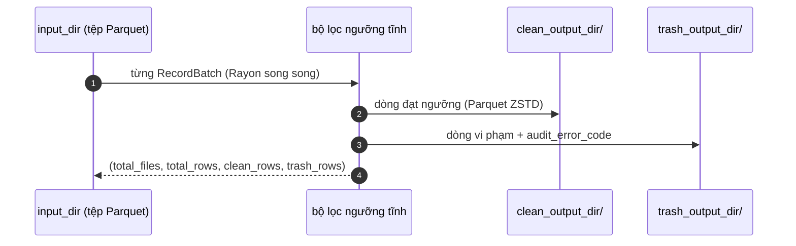

# Đường ống Lakehouse

Các module phía ghi của `src/engine/`: `ingest.rs`, `splitter.rs`, `formats/core/parquet.rs` (bộ ghi lake + gold), `partition.rs` và `memory.rs`.

---

## Nạp dữ liệu (`br.lake.ingest`)

Sao chép thư mục nguồn vào đích lake, giữ nguyên bố cục tương đối:

- Các định dạng theo dòng (`csv, tsv, psv, txt, json, jsonl, ndjson, msgpack, xlsx`) được **chuyển đổi sang Parquet** khi bật chuẩn hóa — qua `auto_normalize=True` hoặc biến môi trường `BR_INGEST_NORMALIZE=1`.
- Còn lại được sao chép nguyên byte.

Trả về `(files_ingested, rows_ingested)`.

## Chia tệp (`br.lake.split_file`)

`split_file_native()` stream một tệp và ghi các phần cố định số dòng:

```python
n = br.lake.split_file("big.csv", max_rows_per_file=100_000,
                       output_dir="./parts", format="parquet")  # → số phần đã ghi
```

Định dạng đầu ra là mọi extension ghi được (ví dụ `parquet`, `csv`). Các phần đặt tên `<stem>_part_NNN.<format>`.

## Ghi lake Sạch/Rác (`br.lake.process_and_write_lake`)

Đọc song song mọi tệp **Parquet** dưới `input_dir` (tuỳ chọn thu hẹp bằng `partition_filter` kiểu Hive), áp ngưỡng chất lượng **tĩnh** cho từng batch, rồi ghi hai cây Parquet phản chiếu bố cục tương đối của input:



Trả về `(total_files, total_rows, clean_rows, trash_rows)`. Tệp Trash mang cột [`audit_error_code`](simd-kernel.md#cot-kiem-toan-tren-bang-trash) giống lọc động. Toàn bộ phần ghi nén ZSTD; kích thước batch tự điều chỉnh theo số tệp chạy đồng thời.

## Bảng Gold (`br.lake.generate_gold_table`)

Đọc lại thư mục clean **Parquet** và xuất bản lại thành bảng có phiên bản:

```python
files, gold_rows, manifest = br.lake.generate_gold_table(
    "clean/", "gold/", table_version="v1",
)
```

- Đường dẫn đầu ra phản chiếu cấu trúc tương đối của `clean/` dưới `gold/` (nén ZSTD).
- Ghi `_gold_metadata.json` cạnh dữ liệu: tên bảng, phiên bản, epoch tạo, tổng tệp/dòng.
- Trả về `(total_files_read, gold_rows_written, manifest_path)`.

---

## Ngân sách bộ nhớ & Runtime

Mọi luồng đọc/ghi streaming dùng chung một ngân sách từ `src/engine/memory.rs`:

| Cơ chế | Giá trị |
| :--- | :--- |
| Trần số dòng mỗi luồng | `BUDGET_BATCH_ROWS = 1 << 20` |
| Mở rộng song song | mỗi luồng trong N luồng nhận `budget_batch_rows(N)` dòng |
| Trần RAM tổng | biến môi trường `BASALTIC_RED_MAX_RAM_GB`, mặc định **2 GB** |
| Hệ số an toàn | ×3.5 cho buffer tạm mask/clean/trash |

Hai runtime cấp tiến trình được tạo lười: runtime tokio đa luồng (`global_runtime()`, dùng cho luồng DataFusion) và pool Rayon có kích thước (`global_rayon_pool(threads)`). `recommend_batch_size(parallel_streams)` trả về số dòng mỗi luồng đã tính nếu bạn cần truyền `batch_size` tường minh.
