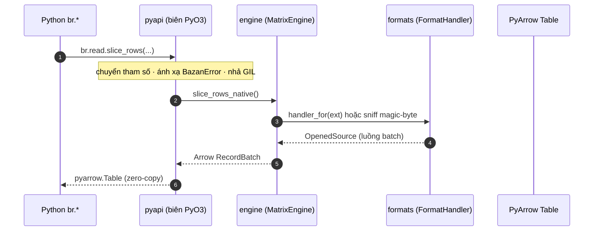

# Tổng quan Kiến trúc

`basaltic-red` là một crate Rust duy nhất được biên dịch thành Python extension (`cdylib`) qua [PyO3](https://pyo3.rs) + Maturin. Mọi lệnh Python đều đi qua một engine dùng chung đến các module chuyên trách.

---

## Bản đồ dự án

Mỗi trang Thành phần đều ghi rõ file nguồn ngay trong nội dung. Bảng dưới đây là bản đồ điểm vào; cây đầy đủ luôn xem được tại [GitHub repo browser](https://github.com/VanDung-dev/basaltic-red/tree/master/src).

| Thành phần | Vị trí trong `src/` | Trách nhiệm | Tài liệu |
| :--- | :--- | :--- | :--- |
| Điểm vào module | `lib.rs` | Đăng ký submodule & class (`#[pymodule]`) |, |
| Phân loại lỗi | `error.rs` | Các variant `BazanError` ánh xạ sang exception Python | [Lõi MatrixEngine](matrix-engine.md) |
| Duyệt tệp | `utils.rs` | Bộ duyệt đệ quy, có ý thức phân vùng | [Đường ống Lọc](filtering-pipeline.md) |
| Cờ lọc tĩnh | `filter.rs` | Cờ bit kiểm toán theo ngưỡng cố định | [Lõi MatrixEngine](matrix-engine.md#loc-tinh-vs-ong) |
| Biên Python | `pyapi/` | Namespace `br.*`, chuyển tham số, nhả GIL, engine dùng chung | [Python API Reference](../reference/python-api.md) |
| Lõi engine | `engine/mod.rs` | Struct `MatrixEngine` + ngưỡng chất lượng | [Lõi MatrixEngine](matrix-engine.md) |
| Nhân động | `engine/dynamic_filter.rs` | Parse quy tắc + đánh giá bitmask đa khối | [Nhân SIMD Bitmask](simd-kernel.md) |
| Cắt lát | `engine/slice.rs` | Đọc dòng/cột zero-copy, preview mẫu | [Lõi MatrixEngine](matrix-engine.md#thao-tac-cat-lat-slicing) |
| Lọc song song | `engine/parallel_filter.rs`, `engine/partition.rs` | Lọc đa tệp Rayon, cắt tỉa kiểu Hive | [Đường ống Lọc](filtering-pipeline.md) |
| Tầng định dạng | `engine/formats/` | Trait `FormatHandler`, registry, bộ sniff magic-byte | [Định dạng & Magic Byte](formats.md) |
| Tầng SQL | `engine/sql.rs`, `pyapi/iterator.rs` | Phiên DataFusion, cầu nối `PyBatchIterator` | [Tầng SQL DataFusion](datafusion.md) |
| Lake map | `engine/map.rs` | Danh mục `.br_map.ipc` + Lake Doctor | [Lake Map & Lake Doctor](lake-map.md) |
| Đường ống ghi | `engine/ingest.rs`, `engine/splitter.rs`, `engine/formats/core/parquet.rs` | Ingest, chia tệp, ghi lake sạch/rác, bảng gold | [Đường ống Lakehouse](lakehouse-pipeline.md) |
| Bộ nhớ & runtime | `engine/memory.rs` | Ngân sách RAM, runtime tokio/Rayon toàn cục | [Đường ống Lakehouse](lakehouse-pipeline.md#ngan-sach-bo-nho-runtime) |
| Tiện ích khác | `engine/csv_guard.rs`, `engine/graph.rs`, `engine/recommend.rs` | CSV injection guard, sơ đồ ER Mermaid, gợi ý batch-size |, |

---

## Luồng thực thi theo tầng



1. **Biên Python (`pyapi/`)**, chuyển đổi tham số, ánh xạ [`BazanError`](matrix-engine.md#phan-loai-loi) sang `PyValueError` / `PyRuntimeError` / `PyIOError`, và nhả GIL quanh phần việc native qua `py.detach`.
2. **Lõi engine (`engine/`)**, nắm toàn bộ logic: phân giải định dạng, đọc streaming, lọc, lập kế hoạch SQL.
3. **Tầng định dạng (`formats/`)**, mọi truy cập tệp được phân giải về một `FormatHandler` (tra extension trước, sniff magic-byte sau).
4. **Biên interop**, kết quả quay lại PyArrow qua interface zero-copy; xem [Tầng SQL DataFusion](datafusion.md).

---

## Engine dùng chung

Toàn bộ lệnh namespaced dùng chung một engine cấp tiến trình do `default_engine()` trong `src/pyapi/mod.rs` tạo ra:

```rust
static DEFAULT_ENGINE: OnceLock<MatrixEngine> = OnceLock::new();
// MatrixEngine::new(1, 9, 0.01, 100.0) (ngưỡng chất lượng mặc định)
```

Điều này bảo đảm ngưỡng kiểm tra đồng nhất trên mọi `br.read.*`, `br.filter.*`, `br.lake.*`, ... Muốn ngưỡng riêng, khởi tạo trực tiếp `br.MatrixEngine(min_passenger, max_passenger, min_fare, max_speed_mph)`.

---

## Mô hình bộ nhớ

- Đọc streaming bị chặn ở `BUDGET_BATCH_ROWS = 1 << 20` dòng mỗi batch mỗi luồng.
- Với N luồng song song, mỗi batch tự co lại để tổng số dòng đang bay luôn nằm trong ngân sách, tổng RAM mặc định **2 GB**, chỉnh qua biến môi trường `BASALTIC_RED_MAX_RAM_GB`.
- Chi tiết: [Đường ống Lakehouse](lakehouse-pipeline.md#ngan-sach-bo-nho-runtime) và `src/engine/memory.rs`.
