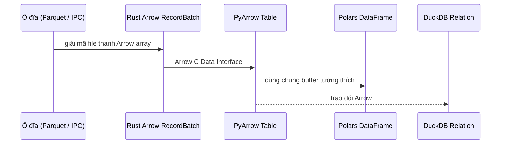

# Các khái niệm cơ bản

Hiểu rõ nền tảng kiến trúc của `basaltic-red`.

---

## 1. Trao đổi dữ liệu Apache Arrow

`basaltic-red` sử dụng định dạng bộ nhớ cột tiêu chuẩn Apache Arrow trong các thao tác. Reader giải mã Parquet, IPC và định dạng hỗ trợ khác thành `RecordBatch`; đọc file nén hoặc mã hóa không phải zero-copy từ ổ đĩa. Ở ranh giới Rust/Python, Arrow C Data Interface có thể chuyển buffer Arrow tương thích mà không copy. Thư viện phía sau vẫn có thể copy nếu cần chuyển đổi hoặc layout không tương thích.

---

## 2. Nhân SIMD Bitmask Đa Khối (Multi-Chunk)

Thay vì tạo các mảng boolean trung gian gây tốn RAM, `basaltic-red` cập nhật trực tiếp cờ bit trên bộ nhớ liên tục `Vec<u64>`:
- **Không giới hạn số quy tắc**: Hỗ trợ >64 quy tắc mượt mà qua nhiều khối 64-bit.
- **Mã lỗi Bitwise (Audit Error Code)**: Mỗi dòng bị loại trong bảng Trash được gắn kèm `audit_error_code`, bitmask `UInt64` trong đó bit thứ *i* báo hiệu quy tắc *i* bị vi phạm. Khi dùng hơn 64 quy tắc, cột danh sách `audit_violated_rules` bổ sung sẽ ghi lại toàn bộ chỉ số vi phạm.

---

## 3. Bản đồ nhị phân (`.br_map.bazan`) & Bác sĩ Data Lake

Thay vì dựng lại số dòng và thống kê từ đầu, `basaltic-red` duy trì catalog `.br_map.bazan`:
- Chứa đường dẫn tương đối, dung lượng, thời gian sửa đổi, số dòng và thống kê min/max từng cột.
- Load catalog đã tồn tại dùng `memmap2` (khoảng 0.5 ms trong lần chạy `demo.ipynb` đã ghi; thực tế tùy phần cứng/hệ thống file). Doctor vẫn discovery file hiện tại và kiểm tra đường dẫn, dung lượng, thời gian sửa đổi.
- `br.lake.doctor` phát hiện file đã discovery bị thiếu index, sửa đổi hoặc mất tích và có thể lập chỉ mục lại catalog. So sánh drift dựa trên path, dung lượng và thời gian sửa đổi thay vì hash nội dung; khi chữa lành, công cụ đọc lại file mới hoặc đã sửa để dựng entry map.
