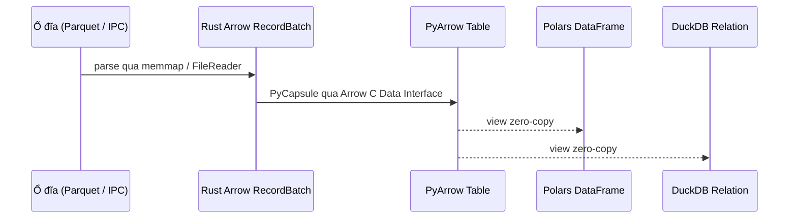

# Các khái niệm cơ bản

Hiểu rõ nền tảng kiến trúc của `basaltic-red`.

---

## 1. Kiến trúc Zero-Copy Apache Arrow

`basaltic-red` sử dụng định dạng bộ nhớ cột tiêu chuẩn của Apache Arrow cho mọi tác vụ. Khi đọc tệp Parquet hoặc IPC, dữ liệu nhị phân thô được phân tích trực tiếp thành cấu trúc `RecordBatch`. Khi chuyển tiếp sang Polars, PyArrow hay DuckDB, hệ thống chỉ hoán đổi con trỏ qua Arrow C Data Interface mà không copy byte dữ liệu.

---

## 2. Nhân SIMD Bitmask Đa Khối (Multi-Chunk)

Thay vì tạo các mảng boolean trung gian gây tốn RAM, `basaltic-red` cập nhật trực tiếp cờ bit trên bộ nhớ liên tục `Vec<u64>`:
- **Không giới hạn số quy tắc**: Hỗ trợ >64 quy tắc mượt mà qua nhiều khối 64-bit.
- **Mã lỗi Bitwise (Audit Error Code)**: Mỗi dòng bị loại trong bảng Trash được gắn kèm `audit_error_code`, bitmask `UInt64` trong đó bit thứ *i* báo hiệu quy tắc *i* bị vi phạm. Khi dùng hơn 64 quy tắc, cột danh sách `audit_violated_rules` bổ sung sẽ ghi lại toàn bộ chỉ số vi phạm.

---

## 3. Bản đồ nhị phân (`.br_map.ipc`) & Bác sĩ Data Lake

Thay vì quét đệ quy hàng ngàn tệp trên ổ đĩa ở mỗi truy vấn, `basaltic-red` duy trì tệp bản đồ `.br_map.ipc`:
- Chứa đường dẫn tương đối, dung lượng, thời gian sửa đổi, số dòng và thống kê min/max từng cột.
- Đọc warm qua `memmap2` (sub-mili-giây trong `demo.ipynb`; thực tế tùy phần cứng/hệ thống file).
- `br.lake.doctor` phát hiện drift (thiếu/sửa/chưa index) và tự động chữa lành catalog.
