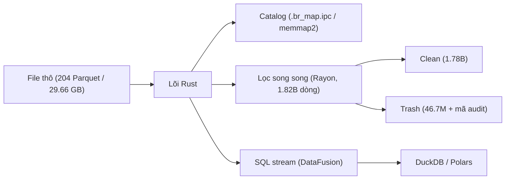

# Basaltic-Red

<p align="center">
  <strong>Engine Data Lake zero-copy và kiểm tra chất lượng dữ liệu bằng Rust + Apache Arrow (Python qua PyO3)</strong>
</p>

---

## Tổng quan

`basaltic-red` là lõi Rust cho data lake dạng file, kèm lớp Python mỏng. Chức năng: catalog ánh xạ bộ nhớ (`.br_map.ipc`), cắt lát dòng/cột không cần đọc toàn bộ file, lọc chất lượng song song với mã audit theo dòng, và SQL qua DataFusion trên Arrow batch. Kết quả là `pyarrow.Table` / `RecordBatch` để dùng tiếp với Polars, DuckDB, pandas.

Demo trong [`demo.ipynb`](https://github.com/VanDung-dev/basaltic-red/blob/master/demo.ipynb): **NYC TLC Yellow Taxi 2009–2025 — 204 file Parquet, 29.66 GB, 1,826,960,642 dòng × 20 cột**.



## Chức năng chính

- **Catalog (`.br_map.ipc`)**: một file Arrow IPC ở gốc lake; đọc warm qua `memmap2` tránh quét thư mục. Doctor trả về `HEALTHY` / `DRIFT_DETECTED` / `HEALED`.
- **Cắt lát**: `slice_rows` / `slice_cols` chỉ đọc phần được yêu cầu.
- **Lọc**: rule động dạng `cột op giá_trị`, `op ∈ {>=, <=, ==, !=, >, <}`; dòng lỗi mang `audit_error_code` (bitmask `u64`, chia chunk khi >64 rule) và `audit_violated_rules` khi cần.
- **SQL**: DataFusion; `execute_sql_stream` trả về `PyBatchIterator`, `to_pyarrow()` bàn giao batch cho Polars/DuckDB không copy thêm.
- **Định dạng**: đăng ký delimited tùy chỉnh qua `br.formats.register_delimited`; file không có đuôi được nhận diện bằng magic byte.

---

## Kết quả đo trong demo

Một lần chạy `demo.ipynb` trên Apple Silicon / macOS. Tùy phần cứng — chỉ tham khảo.

| Kịch bản | Phạm vi | Quan sát |
| :--- | :--- | :--- |
| Catalog cold vs warm | 204 file | Cold ~18.07 s → warm ~0.5 ms (trung bình 5 lần) |
| Quét khối lượng (chỉ metadata) | 1,826,960,642 dòng | < 1 s (~0.7 s) |
| Lọc toàn lake (5 rule) | 1,826,960,642 dòng | ~21 s (1,780,228,507 clean / 46,732,135 trash) |
| SQL `GROUP BY` một file | 4,305,006 dòng | ~0.1 s |

Vòng lặp lọc là Rust thuần trên Arrow array, LLVM tự vector hóa. Không có intrinsic SIMD viết tay.

---

## Cài đặt nhanh

```bash
uv add "git+https://github.com/VanDung-dev/basaltic-red.git"
```

```python
import basaltic_red as br

report = br.lake.doctor("data/", auto_heal=True)
print(report["status"], report["total_files"])

clean, trash = br.filter.filter_matrix("data/sample.parquet", rules=[
    "passenger_count >= 1",
    "trip_distance > 0.0",
    "fare_amount > 0.0",
])
```

Xem thêm: [Quickstart](getting-started/quickstart.md) · [Lake Doctor](workflows/lake-doctor.md) · [Benchmarks](other/benchmarks.md)
