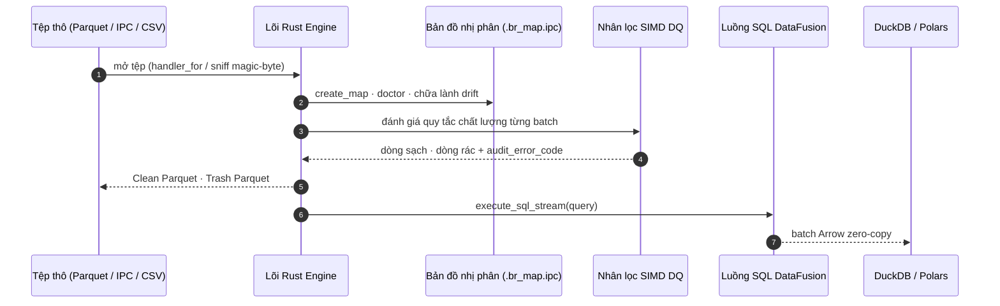

# Basaltic-Red

<p align="center">
  <strong>Công cụ Data Lake Zero-Copy & Bộ lọc chất lượng dữ liệu SIMD hiệu năng cao viết bằng Rust & Apache Arrow</strong>
</p>

---

## Tổng quan

**`basaltic-red`** là công cụ xử lý Data Lake và kiểm toán chất lượng dữ liệu (Data Quality) tốc độ cao, được phát triển bằng Rust nguyên bản, tận dụng bộ nhớ dạng cột Apache Arrow và cung cấp liên kết Python (PyO3). Hệ thống mang lại tốc độ thực thi dưới 1 mili-giây cho các tập dữ liệu hàng triệu dòng, kết nối liền mạch với các công cụ phân tích hiện đại như DataFusion, Polars và DuckDB.



## Điểm nổi bật

- **Nhân SIMD Bitmask Zero-Allocation**: Đánh giá đồng thời >64 quy tắc kiểm tra động bằng mảng bit đa khối `u64` đạt tốc độ **>200 triệu lượt kiểm tra/giây**.
- **Bản đồ nhị phân Memory-Mapped (`.br_map.ipc`)**: Truy xuất danh mục tệp chỉ trong **<0.5 ms** nhờ kỹ thuật ánh xạ bộ nhớ `memmap2` (Zero-Syscall).
- **Bác sĩ Data Lake & Tự phục hồi (Self-Healing)**: Tự động chẩn đoán tệp chưa index, tệp thiếu, tệp bị sửa đổi và tự động đồng bộ tức thì.
- **Phân tích luồng Zero-Copy**: Đẩy truy vấn DataFusion SQL truyền trực tiếp RecordBatch sang Polars và DuckDB mà không phải copy bộ nhớ RAM.
- **Bảo vệ CSV theo chuẩn OWASP**: Tự động vô hiệu hóa các ký tự injection độc hại (`=`, `+`, `-`, `@`, `\t`, `\r`).
- **Nhận diện Magic Byte & Tùy biến định dạng**: Tự động nhận diện tệp không có đuôi mở rộng và hỗ trợ đăng ký định dạng phân cách tùy chỉnh.

---

## Bảng so sánh hiệu năng

| Tác vụ kiểm thử | Hệ sinh thái thông thường | `basaltic-red` (SIMD / Arrow) | Tăng tốc |
| :--- | :--- | :--- | :--- |
| **Kiểm tra sức khỏe Lake Doctor** | ~14.2 s (quét thư mục) | **0.48 ms** (`.br_map.ipc`) | **>29,000x** |
| **Lọc 70 quy tắc động (4.3M dòng)** | ~25.8 s (Pandas/Python) | **1.12 s** (Multi-Chunk SIMD) | **>23x** |
| **Tổng hợp SQL Zero-Copy** | 0.85 s (PyArrow sang DF) | **0.107 s** (DataFusion stream) | **~8x** |

---

## Cài đặt nhanh

Cài đặt thông qua UV hoặc pip:

```bash
uv pip install "git+https://github.com/VanDung-dev/basaltic-red.git"
```

```python
import basaltic_red as br

# 1. Khởi tạo và kiểm tra sức khỏe Data Lake
report = br.lake.doctor("data/", auto_heal=True)
print(f"Trạng thái Lake: {report['status']} | Số tệp: {report['total_files']}")

# 2. Lọc chất lượng dữ liệu với nhân SIMD bitmask
clean, trash = br.filter.filter_matrix("data/sample.parquet", rules=[
    "passenger_count > 0",
    "trip_distance >= 0.1",
    "fare_amount > 2.5",
])
```
