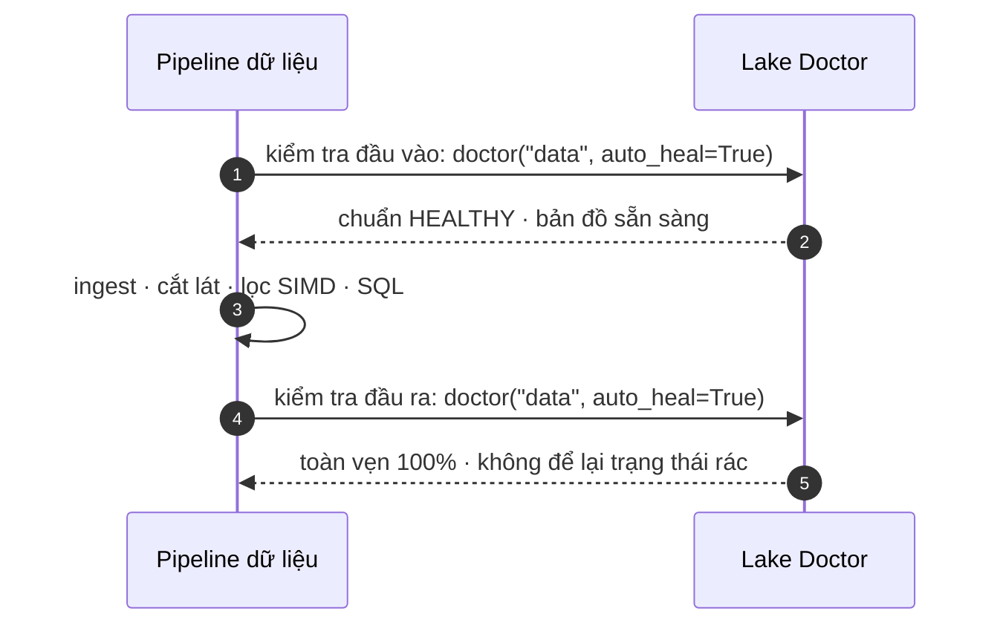

# Luồng Bác sĩ Data Lake & Tự phục hồi

## Chu trình vận hành chuẩn

Bác sĩ Data Lake là điểm bắt đầu và điểm kết thúc bắt buộc trong mọi pipeline xử lý dữ liệu:



## Code mẫu

```python
import basaltic_red as br

# Chạy chẩn đoán
status = br.lake.doctor("data", auto_heal=False)
if status["status"] != "HEALTHY":
    print("Phát hiện sai lệch! Đang tự phục hồi...")
    br.lake.doctor("data", auto_heal=True)
```
