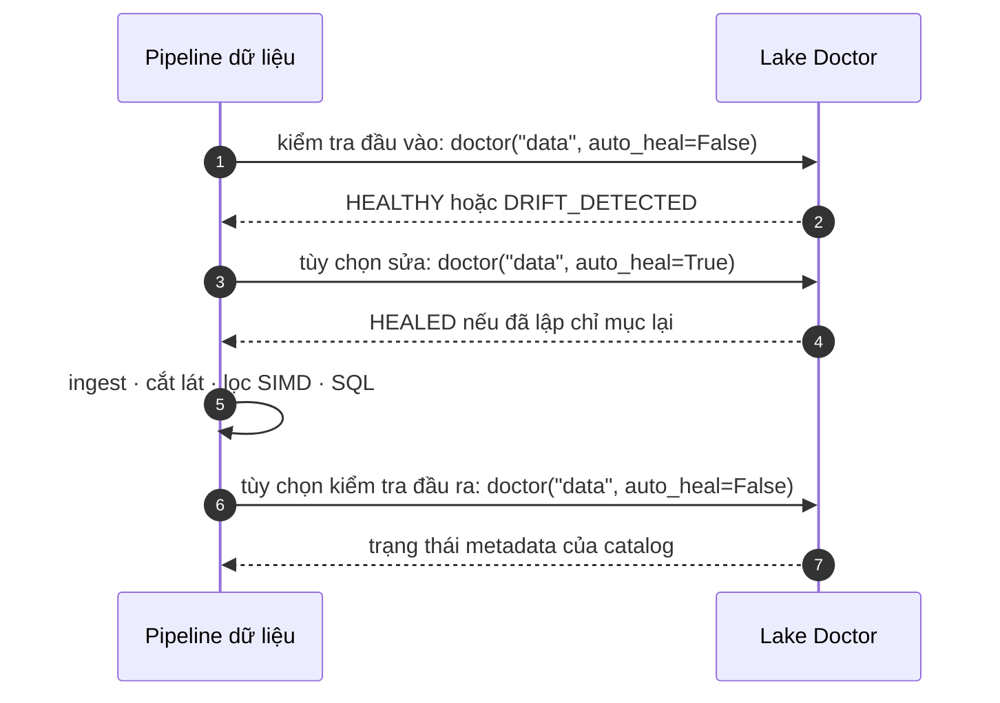

# Luồng Bác sĩ Data Lake & Tự phục hồi

## Chu trình vận hành chuẩn

Dùng Lake Doctor để kiểm tra catalog và tùy chọn sửa metadata bị lệch. So sánh drift discovery file theo extension hỗ trợ rồi đối chiếu đường dẫn, dung lượng và thời gian sửa đổi; công cụ không checksum byte hay đối chiếu nội dung với baseline bên ngoài. `auto_heal=True` đọc lại file mới hoặc đã sửa để dựng lại entry map. File đọc trực tiếp được nhưng không có extension nằm ngoài phạm vi thư mục này. Hãy đăng ký dynamic handler trong process trước khi chạy nếu muốn tính extension đó vào kết quả.



## Code mẫu

```python
import basaltic_red as br

# Chạy chẩn đoán
status = br.lake.doctor("data", auto_heal=False)
if status["status"] != "HEALTHY":
    print("Phát hiện sai lệch! Đang tự phục hồi...")
    status = br.lake.doctor("data", auto_heal=True)
```

`HEALED` nghĩa là lần gọi này đã dựng lại entry map cho phần sai lệch; chạy Doctor lần nữa để xác nhận catalog chuyển sang `HEALTHY`. `HEALTHY` chỉ có nghĩa đường dẫn, dung lượng và thời gian sửa đổi của file đã discovery khớp với map; Doctor không phát hiện đổi nội dung cùng dung lượng nếu mtime được giữ nguyên.

## Kiểm tra fingerprint nội dung

Mặc định map dùng `fingerprint="metadata"`. Để Doctor phát hiện thay đổi nội dung dù dung lượng và thời gian sửa đổi của file không đổi, hãy tạo map với fingerprint BLAKE3:

```python
br.lake.create_map("data", fingerprint="blake3")
status = br.lake.doctor("data")
if status["status"] != "HEALTHY":
    status = br.lake.doctor("data", auto_heal=True)
```

Map lưu cấu hình của nó và Doctor giữ nguyên cấu hình đó khi tự phục hồi, nên các entry được dựng lại tiếp tục dùng BLAKE3. Slice không hash lại nội dung file; hãy chạy Doctor trước khi slice nếu cần xác minh drift bằng BLAKE3. Nếu Doctor báo drift, dùng `auto_heal=True` trước khi dựa vào kết quả slice qua map.
